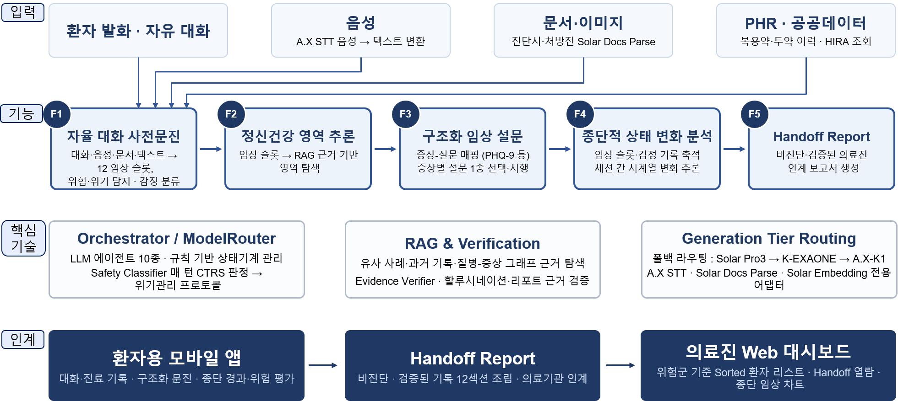
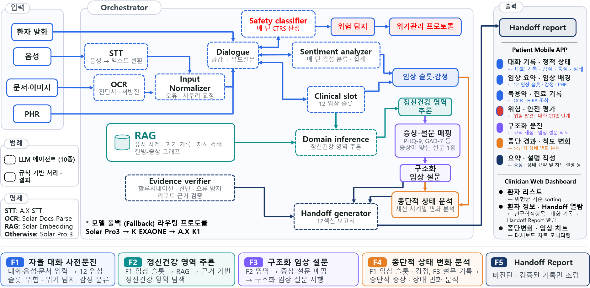
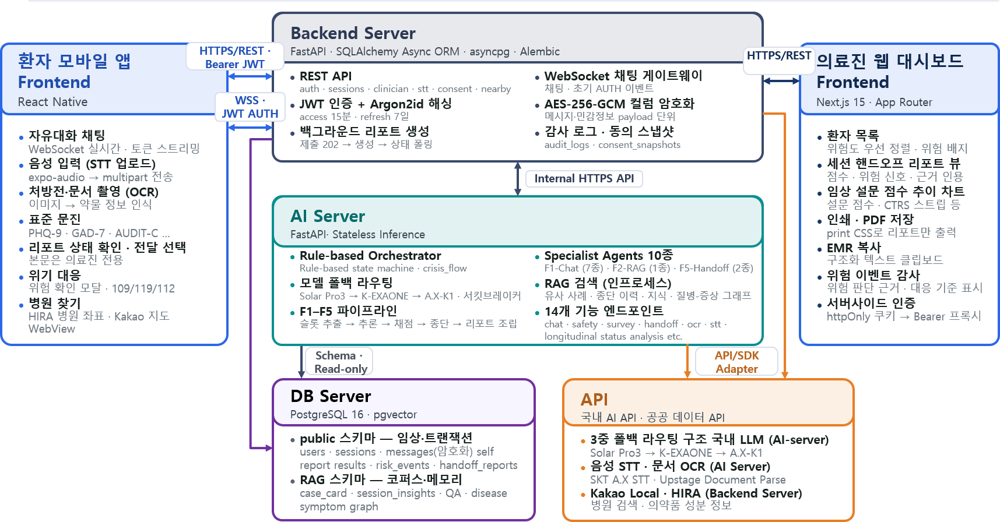

# NeuroSync

**국산 LLM 다중 에이전트 기반 정신건강 진료 전 문진·종단 분석·Handoff 시스템**

2026 인공지능 챔피언 국내 AI 트랙 본선. 아래 구현 범위와 평가 결과는 2026년 7월 30일 중간결과보고서를 기준으로 한다.

## 시스템 구조

*중간결과보고서 그림 1. 대화·음성·문서·PHR 입력에서 의료진 인계까지의 처리 흐름.*

| 단계 | 기능 | 산출물 |
|---|---|---|
| F1 | 대화형 사전문진, STT, OCR, 입력 정규화 | 출처와 시점이 연결된 임상 슬롯 |
| F2 | 환자 기록 및 임상 지식 RAG | 정신건강 영역·진료과 관련 정보 |
| F3 | 증상에 따른 구조화 설문 | 응답과 결정론적 척도 점수 |
| F4 | 과거 기록과 현재 상태 비교 | 신규·지속·호전·악화 변화 |
| F5 | 근거 검증과 보고서 조립 | 비진단형 Handoff Report |

*중간결과보고서 그림 2. 규칙 기반 오케스트레이터 1종과 전문 에이전트 10종.*

| 계층 | 구현 |
|---|---|
| 오케스트레이션 | 규칙 기반 상태기계, 호출 순서·분기·결과 병합 제어 |
| LLM 라우팅 | Solar Pro 3 → K-EXAONE → A.X-K1 폴백 |
| 음성·문서 | A.X STT, Upstage Document Parse |
| 검색 | Solar Embedding, pgvector; 임상 사례카드 1,248건과 전문 QA 1,789건 |
| 근거 검증 | Grounding Filter와 Evidence Verifier |
| 인터페이스 | Expo React Native 환자 앱, Next.js 의료진 대시보드 |
| 서버 | FastAPI, PostgreSQL 16, Docker Compose |

모델 파라미터를 추가 학습하지 않고 역할별 프롬프트, in-context learning, 검색, 출력 검증을 결합했다. 보고서는 증상·상태·기능·위험의 변화를 제공하며 진단·처방 판단은 의료진이 수행한다.

## 평가 결과

**평가 대상은 합성 환자 페르소나 8종이다.** 총 384세션은 모델 비교 216세션, 단일 백본·오케스트레이션 비교 144세션, 호출 구조 통제군 24세션으로 구성된다. 실제 환자 대상 임상 유효성 평가와 구분한다.

### 단일 백본과 오케스트레이션 비교

각 72세션, 중간결과보고서 §3.3.1.

| 지표 | 단일 백본 | NeuroSync |
|---|---:|---:|
| 필터 전 비근거 후보 | 39/84 (46.4%) | 337/611 (55.2%) |
| 최종 임상 산출물에 도달한 비근거 값 | 39건 | 0건 |
| 세션당 기록 오염 | 0.542건 | 0건 |
| 척도 배정 정확도 | 23.8% | 73.0% |
| 슬롯 커버리지 통과율 | 55.6% | 98.4% |
| 세션당 LLM 토큰 | 30,514 | 125,933 |
| 턴당 LLM 누적 대기 | 4.16초 | 9.04초 |
| 호출 지연 중앙값 | 2,721 ms | 1,499 ms |

이 평가에서 비근거 후보 337건은 모두 후단 검증에서 차단됐다. 생성 단계의 비근거 후보 비율은 감소하지 않았다. 정보 추출과 최종 산출물 검증이 개선된 반면, 세션당 토큰과 턴당 누적 대기는 증가했다.

국산 모델별 평가 및 배포 구조

| 백본 | CTRS 등급 적중률 | 세션 완주율 | 척도 배정 정확도 | 임상 슬롯 통과율 |
|---|---:|---:|---:|---:|
| Solar Pro 3 | 52.4% | 96.8% | 66.7% | 60.3% |
| K-EXAONE | 63.5% | 22.6% | 74.6% | 50.8% |
| A.X | 39.7% | 15.4% | 77.8% | 57.1% |

*중간결과보고서 그림 3. 환자 앱, 플랫폼 백엔드, AI 서버, 데이터베이스, 의료진 대시보드.*

## 진행 상황

| 항목 | 상태 |
|---|---|
| F1–F5 통합 시제품 및 환자·의료진 인터페이스 | 구현 및 시연 |
| 합성 시나리오 기반 기능·근거 검증 | 중간평가 완료 |
| 전문의 보고서 평가와 협력병원 PoC | 후속 검증 계획 |
| 조건부 호출·캐싱·비동기 보고서 생성 | 지연·비용 개선 계획 |
| 공개 배포 패키지·설치 가이드·시연 영상 | **To be uploaded** |

출처: 『2026년도 인공지능 챔피언 중간결과보고서 NeuroSync』, §2.2, §3.1, §3.3.1. 수치는 보고서의 시험 조건에서 보고된 결과다.
