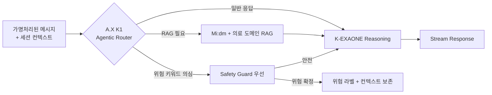
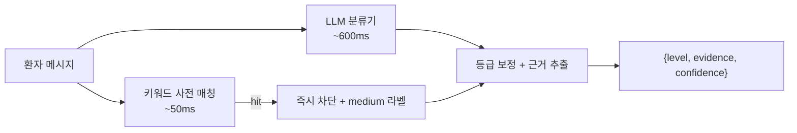

# Neuro-Sync AI 도메인 PRD

> **Version**: 1.0
> **Created**: 2026-06-04
> **Status**: Draft
> **Owner**: AI Research 팀
> **Parent**: [`../prd/PRD_neuro-sync.md`](../prd/PRD_neuro-sync.md) (마스터 PRD)
> **Scope**: 마스터 PRD에서 Owner=AI / Shared(AI 부분)로 표시된 FR과 §5.3 AI 블록의 **AI 내부 설계 상세화**

---

## 1. Scope (AI 팀 단독 책임 범위)

마스터 PRD의 다음 영역을 본 문서가 책임진다.

| 마스터 PRD 참조 | AI 내부 상세 위치 |
|----------------|------------------|
| §3 FR-004 (AI 채팅 응답 생성 부분) | §3 본문 + `prompts/` |
| §3 FR-005, FR-011, FR-022, FR-032 (Safety Guard) | §4 Safety Guard + `safety_guard/` |
| §3 FR-009 (OCR 파싱) | §5 OCR + `ocr/` |
| §3 FR-018 (Handoff Report 생성) | §6 Handoff Report + `prompts/handoff/` |
| §3 FR-033, FR-035, FR-037 (STT 어댑터 내부) | §7 STT Adapter + `stt/` |
| §5.3 Architecture의 AI 블록 (LLM/Safety/OCR/STT) | §2 오케스트레이션 |
| §7 §4.1의 AI-side latency 분할 | §9 AI 메트릭 |

본 문서가 **다루지 않는** 것:
- Auth/RBAC/RLS, DB 스키마, 세션·소비자 동의 UX → 마스터 PRD
- WebSocket transport, Rate Limit, 감사 로그 인프라 → 마스터 PRD
- 모바일 마이크 UI, 키보드 폴백 UI → 마스터 PRD §5.4

---

## 2. 멀티 LLM 오케스트레이션

### 2.1 모델 선택 매핑

상세 비교: [`AI_API_가이드.md`](./AI_API_가이드.md) §0~§6.

| 역할 | MVP (Phase 1) | Post-MVP (Phase 2~3) | 근거 |
|------|--------------|---------------------|------|
| 1차 LLM (채팅 응답, Handoff 요약) | 단일 외부 API (Claude Sonnet 4.6 또는 Solar Pro 3 PoC 후 결정) | **LG K-EXAONE 2차수** (Hybrid Reasoning) | Reasoning 모드 + 임상 추론 적합 |
| Agentic Orchestrator (Tool/Plan) | 미적용 | **SKT A.X K1** (Agentic 벤치 1위) | 다중 도구 라우팅 |
| PHI-격리 추론 (한국어 도메인 RAG) | KT Mi:dm K 2.0 (선택) | KT Mi:dm K 2.0 자가호스팅 | MIT 라이선스, On-prem |
| OCR | **Upstage Document Parse** | 동일 | TEDS 96.06 |
| STT | Whisper (Fallback, 1차) | **SK A.dot STT** (Primary, 계약 후) | 한국어 의료 발화 정확도 가설 |
| 멀티모달 자산(선택) | 미적용 | NC AI VARCO | 환자 교육 보조 |

### 2.2 오케스트레이션 플로우 (Post-MVP)



### 2.3 MVP 단일 LLM PoC 비교 계획

Phase 0 차단 게이트로 결정. 평가 항목 (`eval/llm_poc.md`):
- 한국어 자연도 (KoBALT, Ko-Arena-hard-v2)
- 의료 도메인 정확도 (자체 100건 의료 QA)
- 환각율 (원문 근거 인용 누락 빈도)
- 토큰당 비용
- p95 첫 토큰 지연

---

## 3. 채팅 응답 (FR-004 AI 측)

### 3.1 시스템 프롬프트 정책
- 환자 발화에서 새로운 의학적 사실을 **추론·생성 금지** (Hallucination 방지)
- 후속 질문은 최대 1개씩, 짧고 비전문 용어로
- 응답 100자 이내 권장 (UX), 단 안전 안내는 예외
- 진단·처방 표현 절대 금지 — "병원에서 상담하세요"로 라우팅

### 3.2 스트리밍 인터페이스
Platform이 WebSocket으로 토큰 전달. AI 서비스는 SSE-스타일 청크 반환.

### 3.3 컨텍스트 관리
- 직전 20턴 + 시스템 프롬프트로 제한
- 토큰 초과 시 oldest-first drop, 단 risk_event 전후 8턴은 유지

상세 프롬프트: `prompts/chat/`

---

## 4. Safety Guard (FR-005, FR-011, FR-022, FR-032)

### 4.1 아키텍처
**키워드 사전 + LLM 분류기 병렬 호출 → 더 빠른 결과로 1차 판정 → 늦은 결과로 보정**



### 4.2 등급 정의 (정신과 자문의와 합의 필요)

| 등급 | 의미 | 즉시 액션 |
|------|------|----------|
| `low` | 우울/불안 표현, 자해 의도 없음 | 대화 지속 + 모니터링 |
| `medium` | 자해/타해 모호한 표현, 절망감 | 대화 지속 + 의료진 백그라운드 알림 |
| `high` | 자살·자해 의도 시사 | **즉시 `/emergency` 강제 전환** + 핫라인 |
| `critical` | 임박한 위험·구체 계획 표현 | high 액션 + 위험 통보 동의 옵트인 시 비상연락처 SMS |

### 4.3 SLA
- p95 < 1,000ms (마스터 PRD §4.1)
- Recall ≥ 95% (high/critical) — 놓침이 곧 인명 위험
- Precision ≥ 80% — 과도 차단으로 UX 저해 방지

### 4.4 라벨링 데이터 전략 (Phase 0)
- 합성 데이터 (LLM 생성 + 정신과 전문의 검수)
- 한국어 자살 은어 사전 (보건복지부 자료 + 임상 자문)
- 공개 코퍼스 매핑 (한국어 감정 데이터셋)
- **최소 400건 시나리오별 층화 표본** (각 카테고리 40건+) — 마스터 PRD §7

### 4.5 false negative 방어
- 한 모달리티(키워드)에서 hit이지만 LLM이 안전이라 판정 → **위험 우선 유지**
- LLM 확신도 < 0.5 → high 등급 유지(보수적)

상세: `safety_guard/`

---

## 5. OCR 파이프라인 (FR-009)

### 5.1 벤더: Upstage Document Parse
[`AI_API_가이드.md`](./AI_API_가이드.md) §5.3 기준 — TEDS 96.06, 3.77s.

### 5.2 흐름
1. Platform이 S3 presigned URL 전달
2. AI가 Document Parse API 호출
3. 반환된 HTML/Markdown → AI 후처리 (의료 용어 정규화)
4. 텍스트 + 구조 블록 + confidence 반환

### 5.3 후처리 규칙
- 진단명·약물명 표준화 (KCD-8 / 식약처 약물 코드 매핑 검토)
- 표/차트 영역 → 별도 블록으로 보존 (PHQ-9 점수 표 추출 용이성)
- 손글씨 영역 → confidence < 0.7 시 의료진 확인 권장 플래그

### 5.4 SLA
- p95 < 10s/문서 (마스터 PRD §4.1)
- 정확도: TEDS 95%+ 유지 (Upstage 보고치 대비 ±1%p)

상세: `ocr/`

---

## 6. Handoff Report 생성 (FR-018)

### 6.1 입력
```
{
  session_id, patient_pseudonymous_id,
  messages: [...],
  phq9: {answers, total, severity},
  gad7: {answers, total, severity},
  doc_texts: [...],
  risk_events: [...]
}
```

### 6.2 출력 (Markdown)
필수 섹션:
- 주호소, 현병력, 주요 증상, 시작 시점, 최근 변화, 유발 요인
- 수면/식욕/활동, 과거 정신건강 이력, 복용약
- 문진 점수 (PHQ-9, GAD-7)
- 업로드 문서 요약
- 위험 신호 (있을 때만)
- 의료진 확인 필요 사항
- **각 항목별 원문 근거 인용 링크**: `[message_id: msg_abc]`

### 6.3 원문 근거 인용 강제
- 환자 발화에 없는 정보 생성 금지
- 추론 시 "환자 발화 기준 시사됨" 명시
- 인용 ID 누락 시 검증 단계에서 reject + 재생성

### 6.4 SLA
- p95 < 30s (마스터 PRD §4.1)
- 의사 1차 평가 만족도 ≥ 4.0/5.0 (마스터 PRD §7)

상세 프롬프트: `prompts/handoff/`

---

## 7. STT Adapter (FR-033, FR-035, FR-037)

### 7.1 어댑터 인터페이스 (마스터 PRD §5.1 발췌)
```python
class STTAdapter(Protocol):
    vendor: Literal["skt-adot", "whisper-openai", "whisper-local"]
    async def transcribe(audio, lang, prev_context, timeout_s) -> STTResult: ...
```

### 7.2 폴백 체인
1. **Primary**: SK A.dot STT (계약 후) → 503/timeout 시 폴백
2. **Fallback**: OpenAI Whisper API → 503/timeout 시 폴백
3. **Last resort**: Self-hosted Whisper Large-V3 (GPU 예약 + 대기열)

### 7.3 신뢰도 임계값
- ≥ 0.6: 사용자에게 제시
- < 0.6: 재발화 안내 (FR-037)
- < 0.4: Audio 품질 문제 → 키보드 폴백 권유

### 7.4 벤더 비교 계획 (Phase 1b)
의료 한국어 발화 샘플 100건 자체 녹음 (가상 시나리오) → A.dot vs Whisper vs Whisper Local로 정확도/지연/비용 비교 → `stt/vendor_eval.md`

### 7.5 SLA
- p95 < 2,000ms (Push-to-Talk 모드)
- WER (Word Error Rate) ≤ 15% (한국어 일반 발화 기준)
- 의료 도메인 WER ≤ 20% (의학 용어 가중)

상세: `stt/`

---

## 8. AI 팀 Open Questions

| # | 질문 | 의존성 | 마감 |
|---|------|--------|------|
| AI-1 | MVP 단일 LLM 선택 (Claude / GPT / Solar Pro 3 / Mi:dm) | Phase 0 PoC 100건 | Phase 1a 시작 전 |
| AI-2 | Safety Guard 위험 임계값 — 정신과 자문의와 합의 | 마스터 PRD Phase 0 자문의 섭외 | Phase 1a 시작 전 |
| AI-3 | STT Primary 채택 (A.dot 계약 종속) | 마스터 PRD §8.2 #10 | Phase 1b 중반 |
| AI-4 | 멀티 LLM 오케스트레이션 도입 시점 (Phase 2 vs 3) | LG K-EXAONE 2차수 출시 + SKT A.X K1 API Key | Phase 2 진입 전 |
| AI-5 | 토큰 사용량/비용 모니터링 도구 (LangSmith / 자체) | — | Phase 1b 중반 |
| AI-6 | 프롬프트 버전 관리 정책 (PromptLayer vs Git) | — | Phase 1a 시작 전 |

---

## 9. AI 메트릭 (마스터 PRD §7에서 AI 분리)

| 지표 | 목표값 | 측정 위치 |
|------|--------|----------|
| 위험 발화 Recall (high/critical) | ≥ 95% | `eval/safety_guard/` 회귀 |
| 위험 발화 Precision (high/critical) | ≥ 80% | 동일 |
| Cohen's κ (Safety 라벨 일관성, 임상 자문의 2명) | ≥ 0.7 | 분기별 1회 |
| Handoff Report 의사 만족도 | ≥ 4.0/5.0 (5점 척도) | Phase 2 파일럿 |
| Handoff Report 원문 근거 인용율 | 100% (누락 시 자동 reject) | 자동 검증 |
| 채팅 첫 토큰 latency (p95) | < 800ms | LangSmith / 자체 트레이싱 |
| Handoff Report 생성 latency (p95) | < 30s | 동일 |
| Safety 모듈 latency (p95) | < 1,000ms | 동일 |
| STT WER (한국어 일반) | ≤ 15% | `eval/stt/` |
| STT WER (의료 도메인) | ≤ 20% | 동일 |
| OCR TEDS (Document Parse 후) | ≥ 95% | `eval/ocr/` |
| Hallucination 검출율 (자체 RAG 검증) | < 2% (Handoff Report 기준) | 자동 검증 |

---

## 10. Changelog

- **v1.0 (2026-06-04)**: 마스터 PRD v1.2에서 AI 영역 추출하여 신설.
