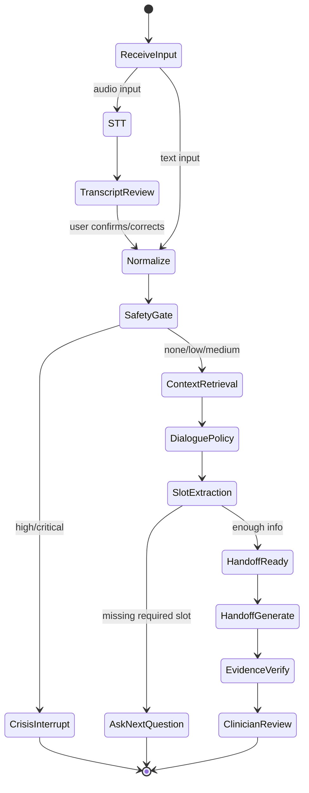

# Orchestration Design Document

> **Version**: 1.0
> **Created**: 2026-06-15
> **Source PRD**: `docs/ai/PRD_ai_v.0.0.0.0.md` sections 4, 5, 7, 8
> **Status**: Implementation-Ready

---

## 1. Overview

### Why Multi-Agent, Not Single-LLM

Neuro-Sync explicitly rejects the single-LLM chatbot architecture (PRD section 0, principle 1). In the mental health domain, a monolithic LLM carries unacceptable risks:

| Risk | Single-LLM Failure Mode | Multi-Agent Mitigation |
|---|---|---|
| Hallucination | LLM invents symptoms, diagnoses, or medication details the patient never mentioned | Separate `EvidenceVerifierAgent` rejects any claim without a source ID |
| Crisis omission | LLM treats suicidal language as conversational and continues normal dialogue | Dedicated `SafetyClassifierAgent` with rule+LLM ensemble runs BEFORE dialogue generation |
| Clinical over-assertion | LLM states a diagnosis or recommends treatment changes | `DialogueAgent` prompt prohibits diagnosis; `EvidenceVerifierAgent` blocks treatment instructions |
| Long-context loss | LLM forgets earlier session details as conversation grows | `TemporalRetrieverAgent` uses pgvector RAG to retrieve evidence across sessions |
| Vendor lock-in | Entire system fails if one vendor degrades | `ModelRouter` selects from a YAML registry with fallback chains per agent |

The architecture separates STT, OCR, Safety, Dialogue, Slot Extraction, RAG, Handoff, and Verification into purpose-built agents, each independently testable, replaceable, and version-controlled.

### Top-Level Architecture

```
Patient Mobile App ──┐
                     ├──> Platform API Gateway ──> Auth/RBAC/RLS
Clinician Dashboard ─┘                        ──> Consent & Audit
                                               ──> Context Gateway
                                               ──> AI Server (Multi-Agent Runtime)

AI Server internals:
  ├── SKT A.X STT Adapter (fixed)
  ├── Solar Document Parse Adapter (fixed)
  ├── Model Router ──> Solar Pro 3 Adapter
  │                ──> K-EXAONE Adapter
  │                ──> A.X K1 LLM Adapter
  ├── Safety Guard
  ├── Temporal RAG Controller
  ├── Handoff Generator
  ├── Evidence Verifier
  └── Offline Eval Harness
```

### Boundary Principles (PRD section 4.2)

- **Mobile/Web to AI**: Never direct. All calls go through the Platform API Gateway.
- **AI Server to DB**: Never direct. Context Gateway API provides scoped data.
- **AI Server to Vendors**: All external calls go through Adapter classes only.
- **Model selection**: Never hardcoded. Always resolved from `agent_model_registry`.
- **Logging**: Raw request/response content logging is off by default. PHI never logged.
- **CoT**: Raw chain-of-thought is never stored or exposed. Only `reason_summary` is permitted.

---

## 2. State Machine

The agent state machine governs every patient interaction from input to handoff (PRD section 5.2).



### State Descriptions

| State | Description | Agent(s) Involved |
|---|---|---|
| `ReceiveInput` | Determine input modality (audio vs text) | Router logic |
| `STT` | Convert audio to transcript via SKT A.X STT | `SttAgent` |
| `TranscriptReview` | User views, edits, and confirms transcript (FR-035) | Mobile App (not AI) |
| `Normalize` | Fix STT noise, typos, colloquial Korean | `InputNormalizerAgent` |
| `SafetyGate` | Rule + LLM parallel classification of risk level | `SafetyClassifierAgent` |
| `CrisisInterrupt` | Block normal dialogue; deliver crisis resources (119/109) | Safety response template |
| `ContextRetrieval` | Fetch prior sessions, documents, scales from pgvector | `TemporalRetrieverAgent` |
| `DialoguePolicy` | Generate one follow-up question to fill missing slots | `DialogueAgent` |
| `SlotExtraction` | Extract CC/HPI/symptoms/medication/risk from messages | `ClinicalSlotAgent` |
| `AskNextQuestion` | Return dialogue response to patient; await next input | Terminal for this turn |
| `HandoffReady` | All required slots filled; trigger report generation | Orchestrator decision |
| `HandoffGenerate` | Draft evidence-grounded Handoff Report | `HandoffGeneratorAgent` |
| `EvidenceVerify` | Validate every claim has a source ID; reject unsupported claims | `EvidenceVerifierAgent` |
| `ClinicianReview` | Deliver verified report to clinician dashboard | Terminal |

---

## 3. Safety-First Pipeline (ADR-005)

**Decision**: Every patient message passes `SafetyClassifierAgent` BEFORE `DialogueAgent` is invoked. If risk level is `high` or `critical`, normal dialogue is bypassed entirely.

### Rationale

In mental health, a missed crisis signal can be life-threatening. Placing safety classification after dialogue generation means the system might already have produced a harmful or inappropriate response before the risk is detected. The cost of false positives (unnecessary crisis responses) is far lower than the cost of false negatives (missed suicidal ideation).

### Pipeline Order

```
Patient message
  |
  v
┌─────────────────────────────────────────┐
│  asyncio.gather (parallel)              │
│    SafetyClassifierAgent (rule + LLM)   │
│    InputNormalizerAgent                 │
└─────────────────────────────────────────┘
  |
  v
SafetyGate decision
  |
  ├── risk >= high ──> CrisisInterrupt (bypass dialogue entirely)
  |                    Return crisis template + 119/109 resources
  |                    Store risk_event
  |                    Flag clinician dashboard
  |
  └── risk < high ──> Continue to ContextRetrieval -> DialoguePolicy -> ...
```

### Safety Merge Policy

The `SafetyClassifierAgent` runs two classifiers in parallel:
1. **Rule-based keyword detector** (Aho-Corasick, ~50ms)
2. **LLM classifier** (~600ms, model selected from benchmark)

Merge rule: `final_risk = max(rule_level, llm_level)`

Special case (SAF-2): If the rule detector returns a hit but the LLM returns `none`, the final risk is kept at `medium` or above. The system never downgrades a keyword hit to `none`.

---

## 4. Agent Routing Rules

### Endpoint-to-Agent Mapping

#### `POST /ai/chat/respond`

The primary chat endpoint. Full pipeline:

```
Request
  |
  v
1. SafetyClassifierAgent ──┐  (parallel via asyncio.gather)
2. InputNormalizerAgent  ──┘
  |
  v
3. OrchestratorAgent (routing decision based on risk + context)
  |
  ├── risk >= high ──> Return crisis template (skip steps 4-5)
  |
  v
4. DialogueAgent (generate one follow-up question)
  |
  v
5. ClinicalSlotAgent (extract structured slots from conversation)
  |
  v
Response: { text, slot_updates, risk_level, model_used }
```

#### `POST /ai/safety/classify`

Direct safety classification without dialogue. Used for standalone risk checks.

```
Request ──> SafetyClassifierAgent (rule + LLM) ──> Response
```

No dialogue, no slot extraction. Returns risk_level, evidence, confidence, recommended_action.

#### `POST /ai/stt/transcribe`

Direct STT without any LLM processing.

```
Request (audio_file_url) ──> SttAgent (SKT A.X STT Adapter) ──> Response
```

Returns transcript, confidence, segments, low_confidence_spans. The transcript is NEVER auto-sent to an LLM (FR-035). User must confirm/edit first.

#### `POST /ai/ocr/parse`

Direct document parsing without dialogue context.

```
Request (file_url) ──> OcrAgent (Solar Document Parse Adapter) ──> Response
```

Returns text_markdown, structured_blocks, medical_entities, confidence scores.

#### `POST /ai/handoff/generate`

Full evidence-grounded report generation with mandatory verification.

```
Request (session data, scales, documents, risk_events)
  |
  v
1. TemporalRetrieverAgent (fetch evidence packets from pgvector)
  |
  v
2. HandoffGeneratorAgent (draft report with evidence citations)
  |
  v
3. EvidenceVerifierAgent (mandatory verification loop)
  |
  ├── unsupported claim found ──> Reject and regenerate (back to step 2)
  ├── diagnosis/treatment violation ──> Reject and regenerate (back to step 2)
  |
  v
Response: { report_markdown, citations, verification }
```

The `EvidenceVerifierAgent` step is mandatory (HAND-4). If unsupported claims are found, the report is rejected and regenerated (HAND-5). This is a reject/regenerate loop, not a single pass.

---

## 5. Model Selection

### ModelRouter

The `ModelRouter` (PRD section 8.2) resolves which model adapter to use for each agent call. It never returns a hardcoded model name.

```python
class ModelRouter:
    async def select_model(
        self,
        agent_name: str,
        task_name: str,
        risk_level: str | None = None,
        require_json: bool = False,
    ) -> ModelSelection:
        # 1. Fixed agent -> return fixed adapter
        # 2. Benchmarked agent -> query agent_model_registry
        # 3. Registry empty -> return eval-required status
        # 4. Failure -> apply fallback chain
```

### Fixed Agents

These agents always use the same vendor. No benchmark selection.

| Agent | Fixed Vendor | Adapter |
|---|---|---|
| `SttAgent` | SKT A.X STT | `SktAkSttAdapter` |
| `OcrAgent` | Solar Document Parse | `SolarDocumentParseAdapter` |

### Benchmarked Agents

These agents select from three LLM candidates based on `agent_model_registry` results.

| Agent | Candidates | Primary Selection Criterion |
|---|---|---|
| `InputNormalizerAgent` | Solar Pro 3, K-EXAONE, A.X K1 | STT noise correction accuracy, latency |
| `SafetyClassifierAgent` | Solar Pro 3, K-EXAONE, A.X K1 + rule | high/critical recall (must be >= 95%) |
| `DialogueAgent` | Solar Pro 3, K-EXAONE, A.X K1 | Korean naturalness, safety, slot completion |
| `ClinicalSlotAgent` | Solar Pro 3, K-EXAONE, A.X K1 | Slot F1, evidence alignment |
| `OrchestratorAgent` | Solar Pro 3, K-EXAONE, A.X K1 | JSON reliability, routing accuracy |
| `TemporalSummaryAgent` | Solar Pro 3, K-EXAONE, A.X K1 | Delta factuality, temporal consistency |
| `HandoffGeneratorAgent` | Solar Pro 3, K-EXAONE, A.X K1 | Unsupported claim count, clinician score |
| `EvidenceVerifierAgent` | Solar Pro 3, K-EXAONE, A.X K1 | False-negative unsupported claim rate |

### Model Registry

```yaml
model_routing_policy:
  fixed:
    stt:
      primary: skt-a-x-stt
    ocr:
      primary: solar-document-parse

  benchmarked_llm_agents:
    candidates:
      - solar-pro-3
      - k-exaone
      - ak-llm
    selection_unit: agent_function
    release_gate:
      safety_critical:
        priority_metric: recall_high_critical
        min_threshold: 0.95
      evidence_generation:
        priority_metric: unsupported_claim_rate
        max_threshold: 0.02
      dialogue:
        priority_metric: clinician_or_user_safety_score
        min_threshold: 4.0
```

Each agent's Primary, Secondary, and Fallback models are stored in the `agent_model_registry` table after benchmark evaluation.

---

## 6. Failure Handling

### Fallback Chain

Every benchmarked agent has a three-tier fallback: **Primary -> Secondary -> Fallback**.

```
Primary model call
  |
  ├── Success ──> Return result
  |
  v (failure)
Secondary model call (exponential backoff)
  |
  ├── Success ──> Return result
  |
  v (failure)
Fallback model call (exponential backoff)
  |
  ├── Success ──> Return result
  |
  v (failure)
Agent-specific safe default (e.g., template response, rule-based output, human review flag)
```

### Failure Triggers

| Trigger | Description | Action |
|---|---|---|
| `timeout` | Model does not respond within configured timeout | Retry with next model in chain |
| `429` | Rate limit exceeded (e.g., SKT A.X RPS 3 limit) | Exponential backoff, then next model |
| `5xx` | Server error from vendor | Retry with next model in chain |
| `invalid_json` | LLM returns unparseable JSON | 1x repair prompt, then next model |
| `safety_uncertain` | Safety confidence < 0.5 or rule/LLM disagreement | Default to `high` risk (conservative) |
| `evidence_verification_failed` | Verifier finds unsupported claims after max retries | Mark report as `requires_clinician_review` |

### Exponential Backoff

```
Attempt 1: immediate
Attempt 2: wait 1s
Attempt 3: wait 2s
Attempt 4: wait 4s (then fail over to next model in chain)
```

No `Retry-After` header is provided by SKT A.X (per API docs section 3.9), so the backoff schedule is client-managed.

### Agent-Specific Safe Defaults

| Agent | Safe Default on Total Failure |
|---|---|
| `SafetyClassifierAgent` | Default to `high` risk. Never default to `none`. |
| `DialogueAgent` | Return template question from prompt registry |
| `InputNormalizerAgent` | Return original text unchanged + uncertainty flag |
| `ClinicalSlotAgent` | Set `requires_human_review = true` |
| `HandoffGeneratorAgent` | Return partial report with missing sections flagged |
| `EvidenceVerifierAgent` | Set `requires_clinician_review = true` |
| `SttAgent` | Typed input fallback (no secondary STT vendor in current set) |
| `OcrAgent` | Manual text input fallback |

---

## 7. Orchestrator Output Contract

The `OrchestratorAgent` produces a structured JSON that drives the next pipeline step (PRD section 5.3).

```json
{
  "next_action": "call_agent | ask_clarifying_question | interrupt_for_safety | generate_handoff | no_op",
  "agents": ["safety_classifier", "temporal_retriever", "dialogue_intake"],
  "risk_gate_required": true,
  "context_required": true,
  "model_candidates": ["solar-pro-3", "k-exaone", "ak-llm"],
  "selected_model": "resolved_by_model_router",
  "reason_summary": "Policy-level short reason. No hidden reasoning.",
  "confidence": 0.0
}
```

### Field Descriptions

| Field | Type | Description |
|---|---|---|
| `next_action` | enum | What the runtime should do next |
| `agents` | list[str] | Which agents to invoke for this action |
| `risk_gate_required` | bool | Whether SafetyGate must pass before proceeding |
| `context_required` | bool | Whether TemporalRetriever should fetch context |
| `model_candidates` | list[str] | Available models (informational; ModelRouter resolves) |
| `selected_model` | str | Resolved at runtime by ModelRouter, never pre-set |
| `reason_summary` | str | Short policy-level explanation. Raw CoT is never included. |
| `confidence` | float | Orchestrator's confidence in the routing decision |

### next_action Values

| Value | Behavior |
|---|---|
| `call_agent` | Invoke the agents listed in the `agents` field |
| `ask_clarifying_question` | Orchestrator needs more info before routing |
| `interrupt_for_safety` | Risk >= high. Skip dialogue. Return crisis template. |
| `generate_handoff` | Enough slots filled. Trigger Handoff pipeline. |
| `no_op` | No action needed (e.g., duplicate message, empty input) |

---

## 8. Concurrency Rules

### Parallel Execution

Safety classification and input normalization are independent and run in parallel:

```python
safety_result, normalized_text = await asyncio.gather(
    safety_classifier.classify(message, context),
    input_normalizer.normalize(message),
)
```

This reduces total latency from ~650ms (sequential) to ~600ms (parallel, bounded by the slower LLM safety classifier).

### Sequential Execution

Dependent agents must run sequentially:

```
Safety + Normalize (parallel)
  -> SafetyGate decision
  -> ContextRetrieval (needs normalized text + risk state)
  -> DialoguePolicy (needs context + slots)
  -> SlotExtraction (needs dialogue response + message history)
```

Handoff pipeline is also sequential:

```
TemporalRetriever (needs patient_id, session data)
  -> HandoffGenerator (needs evidence packets)
  -> EvidenceVerifier (needs draft report + evidence)
  -> [loop if rejected]
```

### Concurrency Constraints

| Rule | Rationale |
|---|---|
| Safety must complete before DialogueAgent starts | ADR-005: Never generate dialogue without safety clearance |
| Normalize must complete before ContextRetrieval | RAG queries need clean text, not raw STT output |
| HandoffGenerator must complete before EvidenceVerifier | Verifier checks the draft, which must exist first |
| EvidenceVerifier rejection restarts HandoffGenerator | Reject/regenerate loop, not a single pass |
| STT is never auto-chained to LLM | FR-035: User must confirm transcript before it enters the pipeline |

---

## Appendix: Runtime Directory Structure

```
ai-server/
  app/
    routes/
      chat.py           # POST /ai/chat/respond
      safety.py         # POST /ai/safety/classify
      stt.py            # POST /ai/stt/transcribe
      ocr.py            # POST /ai/ocr/parse
      handoff.py        # POST /ai/handoff/generate
      eval.py           # POST /ai/eval/model-comparison
    agents/
      orchestrator.py
      stt.py
      input_normalizer.py
      safety_classifier.py
      dialogue.py
      clinical_slot.py
      ocr.py
      temporal_retriever.py
      handoff_generator.py
      evidence_verifier.py
      prompt_eval.py
    adapters/
      skt_ak_stt.py
      solar_document_parse.py
      solar_pro3.py
      k_exaone.py
      ak_llm.py
    routing/
      model_router.py
      agent_model_registry.py
      fallback_policy.py
    prompts/
      registry.py
      loader.py
    schemas/
      ai_contracts.py
      evidence.py
      safety.py
      handoff.py
    eval/
      datasets/
      runners/
      metrics.py
```
