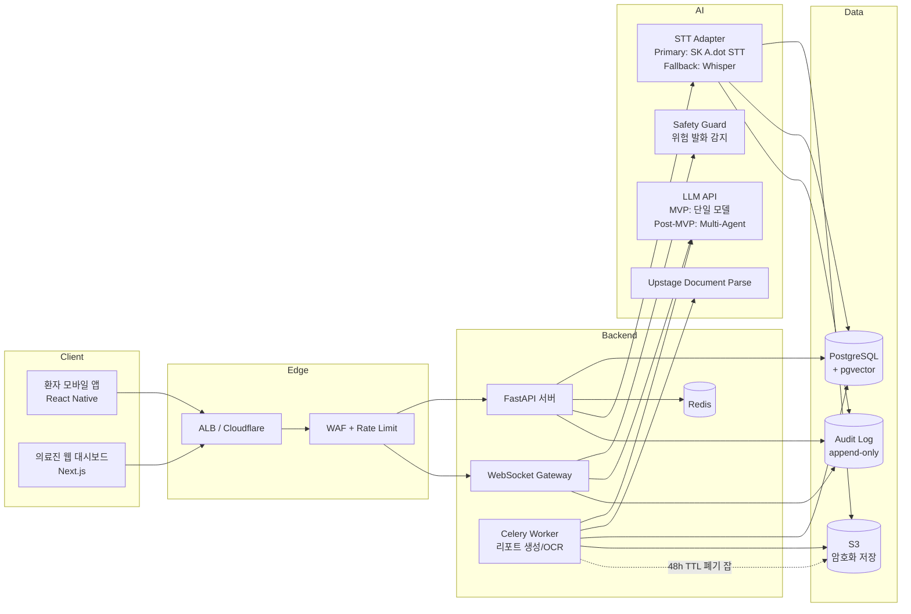
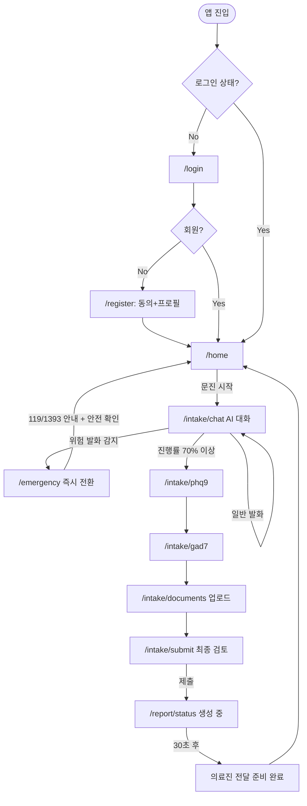
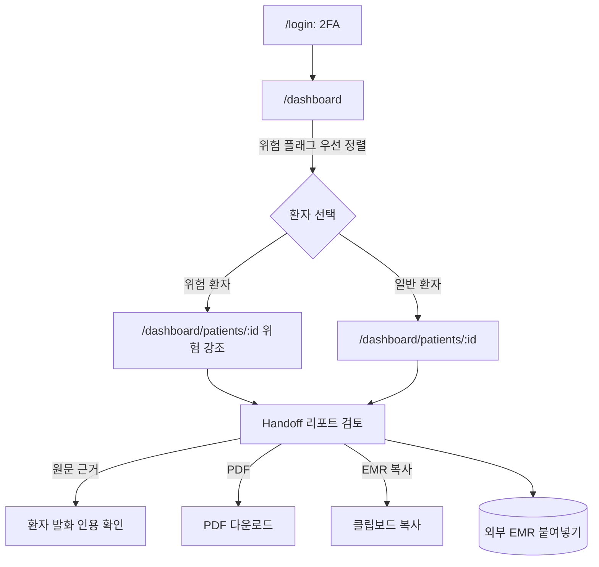
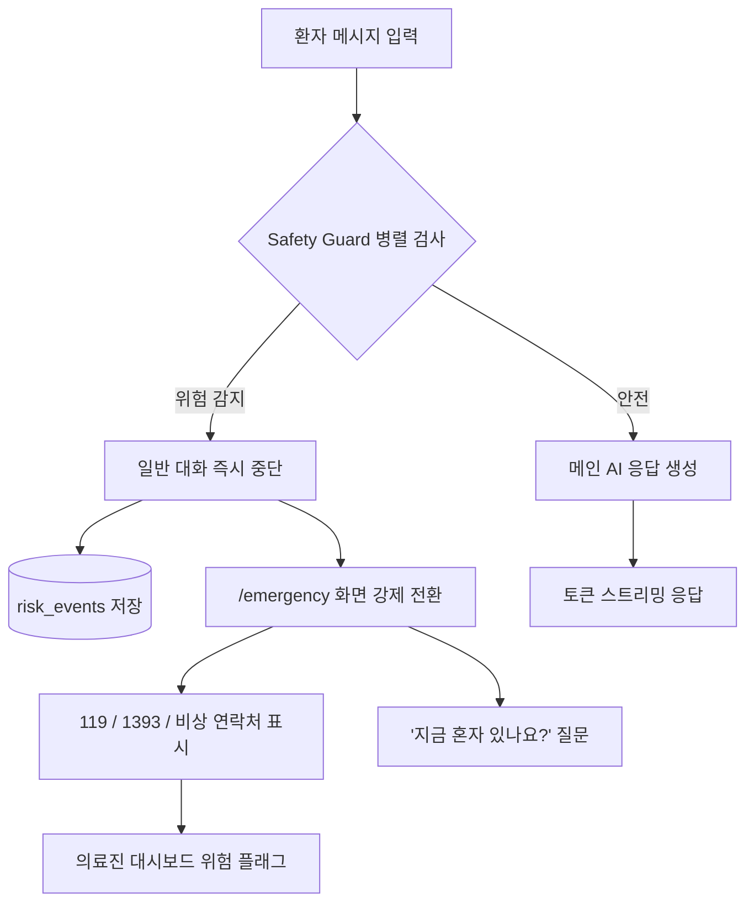
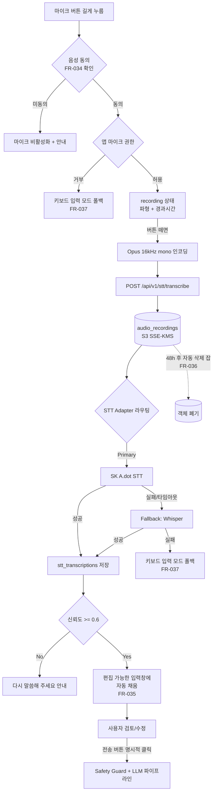

# Neuro-Sync PRD (마스터)

> **Version**: 1.4
> **Created**: 2026-06-02
> **Updated**: 2026-06-04 (§6 8주 데모 일정으로 재구성, 비개발 의사결정 제거)
> **Status**: Draft
> **Source**: `Neuro-Sync 프로젝트 개요.pdf` (개요서 기준), `AI챔피언 제안서_국내트랙_260423_최종.hwpx` (보조 참조)
> **Scale Grade**: Startup (PoC/파일럿) — 의료 도메인 특성상 보안·가용성 Growth급 상향
>
> **Document Scope**: 본 문서는 마스터 PRD로 **인터페이스 contract, 비AI 영역(Auth/DB/FE/Infra/Security), 공유 NFR**의 단일 소스이다. **AI 내부 설계(LLM/Orchestration/Safety 내부/STT 어댑터/OCR 파이프라인/프롬프트/평가)** 는 [`docs/ai/PRD_ai.md`](../ai/PRD_ai.md)에서 별도 관리한다.

## 0. Ownership Matrix

본 프로젝트는 **Platform 팀**과 **AI Research 팀**이 분리된 워크스페이스에서 병행 작업한다.

### 0.1 워크스페이스 — 문서

| 워크스페이스 | 경로 | 소유 팀 |
|------------|------|--------|
| 마스터 PRD (본 문서) | `docs/prd/PRD_neuro-sync.md` | Platform 주도 / AI Research 협의 수정 |
| 마스터 PLAN | `docs/todo_plan/PLAN_neuro-sync.md` | Platform 주도 |
| **AI 도메인 PRD** | [`docs/ai/PRD_ai.md`](../ai/PRD_ai.md) | **AI Research 단독** |
| **AI 팀 PLAN** | [`docs/ai/PLAN_ai.md`](../ai/PLAN_ai.md) | **AI Research 단독** |
| AI API 가이드 (5종 벤더) | [`docs/ai/AI_API_가이드.md`](../ai/AI_API_가이드.md) | AI Research |
| AI 세부 작업 폴더 | [`docs/ai/`](../ai/) (orchestration/prompts/safety_guard/stt/ocr/eval) | AI Research |
| 원본 PDF 자료 | 프로젝트 루트 `references/*.pdf` | 공유 read-only |

### 0.1.1 워크스페이스 — 코드 (monorepo)

코드 작업도 동일한 owner 경계로 분리한다. 자동 리뷰어 할당은 [`.github/CODEOWNERS`](../../.github/CODEOWNERS)가 강제한다.

| 폴더 | 소유 팀 | 내용 |
|------|--------|------|
| [`apps/api/`](../../apps/api/) | **Platform 단독** | FastAPI 백엔드: Auth, DB, WebSocket 게이트웨이, Celery 워커, AI 서버 HTTP 클라이언트 |
| [`apps/mobile/`](../../apps/mobile/) | **Platform 단독** | React Native 환자 앱 (마이크 UI 포함) |
| [`apps/web/`](../../apps/web/) | **Platform 단독** | Next.js 의료진 대시보드 |
| [`apps/ai-server/`](../../apps/ai-server/) | **AI Research 단독** | FastAPI AI 서비스 — §0.3의 5개 인터페이스 구현 |
| [`packages/shared-contracts/`](../../packages/shared-contracts/) | **공유 (양 팀 리뷰 필수)** | Pydantic + TypeScript 인터페이스 스키마 (single source) |
| [`infra/`](../../infra/) | **Platform 단독** | 배포 매니페스트·CI·시크릿. AI 팀은 환경변수·리소스 요구를 PR로 제안. |
| [`tools/`](../../tools/) | Platform 주도, 양 팀 기여 | 공유 dev 스크립트 |

**통신 경계**:
- 모바일/웹 → **`apps/api`만** 호출. AI 서버에 직접 접근 금지.
- `apps/api` → **`apps/ai-server`** 를 내부 HTTP/mTLS로 호출 (§0.3 contract).
- `apps/ai-server` → **DB 직접 접근 금지**. 결과는 HTTP 응답으로만 반환.

**CI 분리**:
- `apps/api`·`apps/mobile`·`apps/web`·`infra` 변경 → Platform 파이프라인
- `apps/ai-server` 변경 → AI 파이프라인 (모델 캐싱 등 별도 step)
- `packages/shared-contracts` 변경 → 양 파이프라인 모두 실행 통과 시 머지

### 0.2 영역 경계 (Boundary Contract)

| 영역 | Owner | 마스터 PRD가 정의 | AI PRD가 정의 |
|------|-------|-------------------|--------------|
| 인증/RBAC/RLS/세션/2FA | Platform | 전부 | — |
| DB 스키마 | Platform | 전체 스키마 | AI 결과 저장 컬럼 사양만 요구 |
| API 라우팅/WebSocket/Rate Limit | Platform | 인터페이스 + transport | AI 응답 페이로드 형식 |
| 모바일/웹 UI | Platform | 화면, 상태, 마이크로카피 | — |
| 동의 수집/감사 로그 인프라 | Platform | UX + 저장 + 무결성 | AI 호출 감사 항목 요청 |
| 파일 업로드 보안/가명처리/삭제 | Platform | 전부 | — |
| 컴플라이언스/법률 자문 | Platform | 전부 | 외부 LLM 위·수탁 검토 협업 |
| **LLM 응답 생성** | AI | 인터페이스 SLA만 | 모델 선택, 프롬프트, 컨텍스트 정책 |
| **멀티 LLM 오케스트레이션** | AI | — | 라우팅·플로우·도구 호출 |
| **Safety Guard 내부 로직** | AI | SLA + 등급 정의 | 키워드 사전, LLM 분류기, 임계값 |
| **STT 어댑터 내부** | AI | 인터페이스 + 동의 정책 | 벤더 선택, 폴백 체인, 후처리 |
| **OCR 파이프라인** | AI | 인터페이스 + SLA | Document Parse 호출 + 의료 용어 후처리 |
| **Handoff Report 생성** | AI | 출력 구조 요구사항 | 프롬프트, 원문 근거 강제 |
| **AI 평가 메트릭** | AI | 종합 §7 (요약) | Recall/Precision/κ/Hallucination 상세 |

### 0.3 인터페이스 Contract (양 팀 변경 시 합의 필수)

AI 서비스가 Platform에 제공하는 5개 인터페이스. **시그니처 변경 시 양 PRD 동시 PR**.

| 인터페이스 | 입력 | 출력 | SLA (마스터 §4.1) |
|-----------|------|------|-------------------|
| `POST /ai/chat/respond` | messages, sessionContext | text(stream), modelUsed | 첫 토큰 < 800ms |
| `POST /ai/safety/classify` | message, prevContext | risk_level, evidence, confidence | < 1,000ms |
| `POST /ai/stt/transcribe` | audio, lang, prevContext | text, confidence, vendor | < 2,000ms |
| `POST /ai/ocr/parse` | file_url(s3), doc_type | text, structured_blocks | < 10s |
| `POST /ai/handoff/generate` | session_id, messages, phq9, gad7, doc_texts, risk_events | report_markdown, citations | < 30s |

**격리 원칙**:
- AI는 DB에 직접 쓰지 않음. 결과는 응답으로만 반환, Platform이 저장.
- AI 입력은 **가명처리된 텍스트** (직접식별자 마스킹 완료) — Platform 책임.
- 외부 LLM/STT 호출 = AI 팀 책임, 위·수탁 계약 = Platform 법무 협업.
- AI 호출 감사 로그(`audit_logs`)는 Platform이 작성, AI는 트레이싱(LangSmith 등)으로 자체 관측.

상세는 [`docs/ai/README.md`](../ai/README.md) §3.

---

## Changelog

- **v1.4 (2026-06-04)**: §6 구현 일정을 **8주 데모 일정**으로 재구성
  - **Phase 0 제거** — 제안서로 해결된 비개발 의사결정(법률 자문·법적 지위·LLM 선정·K-PHQ-9 라이선스·자문의·LOI·라벨링 전략·위험 임계값 등)은 §6 일정에서 제외
  - 일자 명시: Phase 1a (2026-06-04 ~ 06-24, 3주) + Phase 1b (06-25 ~ 07-22, 4주) + Demo Polish (07-23 ~ 07-31, 1주)
  - "Demo 범위 명시" 추가: 데모 IN/OUT 항목 명확 분리
  - 데모에서 제외된 항목(FR-027 만 14세 미만, FR-029 가명처리, FR-030 hash chain, FR-031 세션 타임아웃, FR-032 컨텍스트 보존, FR-008/009 OCR, FR-014/024 알림, FR-012/025 병원, FR-026 실 SMS, STT A.dot Primary)을 Phase 2 task로 이관
  - §8.2 Open Questions를 12건 → 4건으로 축소 (제안서 해결 항목 제거)
  - STT 어댑터는 Whisper 구현만 데모 범위, A.dot 어댑터는 스텁
- **v1.3 (2026-06-04)**: AI/Platform Ownership Matrix 도입 + 코드 워크스페이스 분리
  - §0 신설: 워크스페이스 분리, 영역 경계, 5개 인터페이스 contract
  - §0.1.1 신설: **코드 모노레포 폴더별 owner** (`apps/api`·`apps/mobile`·`apps/web`·`infra` = Platform / `apps/ai-server` = AI / `packages/shared-contracts` = 공유) + 통신 경계 + CI 분리
  - §3 FR 표에 **Owner 컬럼** 추가 (Platform / AI / Shared)
  - AI 영역(LLM/Safety 내부 로직/STT 어댑터/OCR 파이프라인/Handoff 프롬프트)은 [`docs/ai/PRD_ai.md`](../ai/PRD_ai.md)로 분리
  - 본 마스터 PRD의 AI 영역 절(§5.1 STT/§5.3 AI 블록 등)은 **인터페이스만 유지**, 내부 구현은 AI PRD 참조
  - [`docs/ai/AI_API_가이드.md`](../ai/AI_API_가이드.md) — `docs/references/`에서 AI 워크스페이스로 이동
  - 루트 [`apps/`](../../apps/), [`packages/`](../../packages/), [`infra/`](../../infra/), [`tools/`](../../tools/), [`.github/CODEOWNERS`](../../.github/CODEOWNERS), 루트 [`README.md`](../../README.md), [`.gitignore`](../../.gitignore) 골격 생성
- **v1.2 (2026-06-04)**: 음성 입력(STT) 기능 통합 — SK A.dot STT 우선 채택, 폴백 전략 명시
  - FR-033 ~ FR-037 신설: STT 입력, 음성 동의(민감정보), 결과 편집·명시적 전송, 원본 오디오 단기 보존, STT 실패 폴백
  - §2.2 음성 입력 Scenario 추가
  - §4.5.3 음성 데이터 민감정보 처리 정책
  - §4.3.1 보존 매핑표에 `audio_recordings` 추가 (48시간 단기 보존)
  - §5.1 STT API 명세 (REST 업로드 + WebSocket 스트리밍 옵션) + STT Adapter 인터페이스
  - §5.2 `audio_recordings`, `stt_transcriptions` 테이블
  - §5.3 Architecture에 STT 블록 추가 (Adapter → SK A.dot STT / 폴백 Whisper)
  - §5.4 `/intake/chat` Push-to-Talk UI, §5.4.1 recording / transcribing 상태 추가
  - §5.5 Flow D 신규: 음성 입력 → 편집 → 전송 파이프라인
  - §6 Phase 1b 후반에 STT 어댑터 통합 (A.dot 계약 지연 시 Whisper 폴백)
  - §8.2 Open Question: SK A.dot STT API 발급/단가/계약 일정
- **v1.1.1 (2026-06-04)**: §5.5 User Flow Mermaid 차트 3종(Flow A/B/C) syntax 오류 수정
  - `Login[/login]` 형식이 mermaid parallelogram(`[/text/]`) 마커로 오인식되어 파싱 실패 → `Login["/login"]` 형태로 인용 부호 적용
  - Flow C의 `SafetyQ["지금 혼자 있나요?" 질문]` → 노드 텍스트 중간 이중 따옴표가 파싱 종료 → `SafetyQ["'지금 혼자 있나요?' 질문"]`로 단일 따옴표 교체
  - 슬래시 포함 edge label(`119/1393 안내`) → `|"..."|` 인용
- **v1.1 (2026-06-02)**: prd-reviewer Critical 8건 반영
  - C-1 위험 통보 법적 근거 → §4.5, FR-026, §5.2 risk_events 컬럼 추가
  - C-2 미성년자/법정대리인 동의 → FR-027, FR-001/002 분기, §5.1 register API
  - C-3 Recall 검증셋 거버넌스 → §7, Phase 0 라벨 데이터 전략 (PLAN 연계)
  - C-4 K-PHQ-9/GAD-7 라이선스 → Phase 0 차단 게이트 (PLAN), §6 의존성
  - C-5 데이터 보존/삭제 충돌 → §4.3 필드별 보존 매핑표, §4.5 법적 지위
  - C-6 MVP 일정 Under-Spec → §6 Phase 1을 1a/1b 분할 + 인력 가정 명시
  - C-7 WebSocket 토큰 노출 → §5.1 인증을 `auth:connect` 초기 프레임으로 단일화
  - C-8 감사 로그 무결성 → §5.2 audit_logs 트리거·해시 체인·SUPER_ADMIN 차단
  - 누락 FR 7건 추가 (FR-026 ~ FR-032)

---

## 1. Overview

### 1.1 Problem Statement

대한민국 정신건강의학과 진료 현장은 다음 문제가 구조적으로 반복된다.

- **초진 대기 1~6개월** 동안 환자 상태 변화가 체계적으로 기록되지 않아 관리 공백이 발생한다.
- 40분 면담 중 **20~30분이 단순 과거력 청취(Triage)** 에 소모되어 의사의 실질 치료 시간이 부족하다.
- 환자는 자신의 상태를 두서없이 설명하여 의료진이 핵심 정보를 빠르게 파악하기 어렵다.
- 타 병원 진단서, 처방전, 문진표, 과거 상담 기록이 **여러 장소에 분산**되어 통합 활용이 불가능하다.
- **자살·자해 등 위험 신호가 진료 전 단계에서 놓칠 위험**이 존재한다.

### 1.2 Goals

- 환자가 진료 전 자신의 정신건강 상태를 쉽고 안전하게 기록할 수 있게 한다.
- 자유 대화, 표준 문진(PHQ-9/GAD-7), 외부 의료문서 업로드를 **하나의 진료 준비 흐름**으로 통합한다.
- AI가 환자의 비정형 입력을 의료진이 5초 내에 판독 가능한 **구조화 Handoff 리포트**로 변환한다.
- 의료진이 진료 전에 주호소·현병력·위험 신호·문진 점수·과거 기록을 빠르게 확인할 수 있게 한다.
- **위험 발화 감지 시 즉시 안전 안내 및 응급 라우팅**(119/1393)으로 전환하는 안전망을 시스템 레벨에서 내재화한다.
- 병원/의료진 행정 부담을 줄이는 **B2B 의료 행정 SaaS**로 발전시킨다.

### 1.3 Non-Goals (Out of Scope)

본 서비스는 **AI가 환자를 진단하거나 치료하는 서비스가 아니다**. 다음은 명시적으로 제외한다.

- AI에 의한 **진단명 단정** (예: "당신은 우울증입니다")
- AI에 의한 **치료법 지시 또는 약물 변경 권고**
- 식약처 SaMD(Software as a Medical Device) 인허가 대상 기능
- 환자 간 **커뮤니티/소셜 기능**
- **장기 치료 관리**(처방 관리, 복약 알림 등)
- **보험/결제** 기능 (B2B 구독 외)

### 1.4 Scope

| 포함 (MVP) | 제외 (Post-MVP) |
|------------|-----------------|
| 환자 회원가입/로그인, 기본 프로필 | EMR/OCS 직접 연동 |
| 사전 문진 AI 채팅 | HL7 FHIR 완전 구현 |
| PHQ-9, GAD-7 표준 문진 | PHR/마이데이터 실시간 연동 |
| 문서 업로드 (진단서/처방전/검사결과) + OCR | 완전한 다중 LLM 오케스트레이션 (RLHF/SFT 대규모 학습) |
| 위험 신호 실시간 탐지 + 안전 화면 | 고도화된 병원 추천 알고리즘 (증상군 기반) |
| 지역 기반 병원 검색 + 응급기관 라우팅 | 의료진 간 협업 메모 |
| 의료진 대시보드 + Handoff 리포트 + PDF | 환자 커뮤니티 |
| 위험 이벤트 로그 저장 | 장기 치료 관리 (처방/복약 알림) |
| **만 14세 이상 사용자** + 만 14세 미만 법정대리인 동의 흐름 | 만 8세 미만 사용자 (Phase 4+ 별도 검토) |
| **법률 자문 결과 반영된 동의 모델** | 자율 옵트아웃 위험 통보 (법적 정리 전까지 자동 응급기관 통보 보류) |

---

## 2. User Stories

### 2.1 Primary Users

#### Patient (환자)

- As a **정신과 초진 대기 환자**, I want to **앱에서 미리 내 증상과 상황을 정리**해서 **진료실에서 두서없이 설명하지 않고 의사가 핵심을 빠르게 파악하게 하고 싶다**.
- As a **재진 환자**, I want to **지난 방문 이후 상태 변화를 기록**해서 **의사가 진행 경과를 한눈에 보게 하고 싶다**.
- As a **불안·우울 증상이 심한 사용자**, I want to **위기 순간에 즉각적인 응급 연락처(1393, 119) 안내를 받고 싶다**.

#### Clinician (의료진)

- As a **정신건강의학과 전문의**, I want to **진료 직전 환자의 사전 문진 요약을 30초 안에 확인**해서 **40분 면담 중 실질 치료에 집중하고 싶다**.
- As a **의료진**, I want to **PHQ-9/GAD-7 점수, 위험 신호, 업로드 문서를 한 화면에서 보고** 싶다.
- As a **의료진**, I want to **Handoff 리포트를 EMR에 복사 가능한 텍스트로 받고 PDF로 다운로드** 하고 싶다.

#### Admin (병원/서비스 관리자)

- As a **병원 관리자**, I want to **소속 의료진 계정과 환자 세션을 관리**하고 **위험 이벤트 로그를 감사**하고 싶다.

### 2.2 Acceptance Criteria (Gherkin)

**Scenario: 사전 문진 작성 및 제출**
```
Given 로그인한 환자가 홈 화면에 있다
When 사전 문진 시작 버튼을 누른다
Then AI가 자유 대화로 주호소를 묻는 채팅 화면이 열린다
And 진행률 표시가 0%로 시작한다
When 환자가 PHQ-9 9문항과 GAD-7 7문항에 응답한다
Then 총점이 자동 계산되어 저장된다
When 환자가 최종 제출 버튼을 누른다
Then "의료진 전달 준비 중" 상태로 변경되고
And 백엔드는 5분 이내에 Handoff 리포트를 생성한다
```

**Scenario: 위험 발화 감지 시 즉시 라우팅**
```
Given 환자가 사전 문진 채팅 중이다
When 환자가 자살·자해 의도를 시사하는 메시지를 입력한다
Then 일반 대화 흐름이 즉시 중단되고
And 위험 신호 대응 화면으로 강제 전환되며
And 119, 자살예방상담전화 1393 안내가 표시되고
And "지금 혼자 있나요?" 최소 안전 확인 질문이 표시되고
And 서버에 위험 이벤트가 로그로 저장된다
And 의료진 대시보드의 해당 환자 카드에 위험 플래그가 표시된다
```

**Scenario: 문서 업로드 및 OCR 처리**
```
Given 환자가 문서 업로드 화면에 있다
When 환자가 타 병원 진단서 이미지를 카메라로 촬영해 업로드한다
And 문서 유형을 "진단서"로 선택한다
Then 백엔드는 파일을 암호화 저장하고
And OCR 파싱을 비동기로 실행하여
And 추출된 텍스트가 환자 세션에 연결되고
And Handoff 리포트의 "업로드 문서 요약" 항목에 반영된다
```

**Scenario: 의료진의 환자 리포트 조회**
```
Given 의료진이 본인 기관 환자 목록을 보고 있다
When 위험 신호 플래그가 있는 환자를 클릭한다
Then 환자 상세 페이지가 열리고
And 주호소, 현병력, PHQ-9/GAD-7 점수, 위험 이벤트, 업로드 문서 요약이 표시되며
And 각 항목에 원문 근거(환자 발화 인용) 링크가 있고
And PDF 다운로드 버튼과 EMR 복사용 텍스트 복사 버튼이 표시된다
```

**Scenario: 음성으로 사전 문진 응답 (STT)**
```
Given 환자가 음성 녹음 동의(민감정보)에 옵트인한 상태로 /intake/chat 화면에 있다
When 환자가 마이크 버튼을 길게 눌러 발화한다
Then 녹음 상태 표시(파형 + 경과 시간)가 나타나고
And 마이크 버튼에서 손을 떼는 즉시 녹음이 종료된다
When 백엔드의 STT 어댑터(우선: SK A.dot STT, 폴백: Whisper)가 음성을 텍스트로 변환한다
Then 변환된 텍스트가 입력창에 자동 채워지고
And 환자가 텍스트를 검토·수정한 후 명시적으로 "전송" 버튼을 눌러야 LLM으로 전달된다
And STT 신뢰도가 임계값 이하면 "다시 말씀해 주세요" 안내가 표시된다
And 원본 오디오는 48시간 내 자동 삭제된다 (FR-036)
And 환자가 음성 동의를 옵트아웃 상태라면 마이크 버튼이 비활성화되어 안내 문구가 표시된다
```

**Scenario: STT 실패 시 텍스트 입력으로 폴백**
```
Given 환자가 음성 입력 중이다
When 네트워크 오류, STT API 실패, 또는 침묵·잡음으로 인식 실패가 발생한다
Then 오류 메시지가 표시되고
And 입력창이 키보드 입력 모드로 자동 전환되며
And 녹음된 오디오는 임시 보관되었다가 동일 48시간 정책에 따라 삭제된다
```

### 2.3 User Roles

| Role Key | 한국어 명칭 | 권한 범위 | 비고 |
|----------|------------|----------|------|
| `guest` | 비로그인 사용자 | 약관/소개 페이지만 | 회원가입/로그인 진입 가능 |
| `patient` | 환자 | 본인 세션/문진/문서/리포트 read/write | RLS 적용, 모바일 앱 전용 |
| `clinician` | 의료진 | 소속 기관 환자 read, 리포트 read, 위험 플래그 read/update | 웹 대시보드 전용 |
| `org_admin` | 병원 관리자 | 소속 기관 의료진 계정 관리, 환자 세션 통계, 위험 이벤트 로그 | 웹 대시보드 전용 |
| `super_admin` | 서비스 운영자 | 전체 기관/사용자 관리, 시스템 로그 | service_role |

**규칙**: 환자 데이터는 **본인 + 본인이 진료받는 기관의 의료진**만 read 가능. Row-Level Security(RLS)로 강제.

---

## 3. Functional Requirements

> **Owner 컬럼 범례**: `P` = Platform 단독, `A` = AI Research 단독, `S` = Shared (Platform 인프라/UX + AI 응답). `A` 또는 `S` 행의 AI 내부 설계는 [`docs/ai/PRD_ai.md`](../ai/PRD_ai.md)에서 상세화.

| ID | Owner | Requirement | Priority | Dependencies |
|----|-------|------------|----------|--------------|
| **FR-001** | P | 환자 회원가입/로그인 (이메일+비밀번호, 약관·개인정보·민감정보·**위험 통보** 4개 동의 분리, 동의 이력 스냅샷 저장) | P0 (Must) | - |
| **FR-002** | P | 환자 기본 프로필 입력 (이름, 생년/연령대, 성별, 연락처, 거주 지역, 비상 연락처, 진료 예정 병원) + **연령 검증 분기**: 만 14세 미만은 법정대리인 동의 필수, 만 14~19세는 추가 안내 | P0 | FR-001 |
| **FR-003** | P | 환자 홈 화면 (문진 시작 버튼, 진행 중 세션 표시, 리포트 상태, 위험 도움말 진입, 병원 찾기 진입) | P0 | FR-001 |
| **FR-004** | S | AI 대화형 사전 문진 채팅 (자유 발화 입력, AI 후속 질문, 대화 저장, 진행률 표시, 종료 버튼) — **Platform**: UI/WebSocket/저장. **AI**: 응답 생성 + 후속 질문 ([`PRD_ai.md`](../ai/PRD_ai.md) §3) | P0 | FR-002 |
| **FR-005** | S | 사전 문진 채팅 중 **위험 발화 실시간 감지** 및 일반 대화 중단 — **Platform**: WebSocket 차단/라우팅. **AI**: Safety 분류기 ([`PRD_ai.md`](../ai/PRD_ai.md) §4) | P0 | FR-004 |
| **FR-006** | P | PHQ-9 표준 문진 (9문항, 문항별 응답 선택, 총점 자동 계산, 결과 저장) | P0 | FR-002 |
| **FR-007** | P | GAD-7 표준 문진 (7문항, 문항별 응답 선택, 총점 자동 계산, 결과 저장) | P0 | FR-002 |
| **FR-008** | P | 문서 업로드 (카메라/갤러리/PDF, 문서 유형 선택, 상태 표시, 목록 확인, 삭제 요청) | P0 | FR-002 |
| **FR-009** | S | 업로드 문서 OCR 파싱 → 텍스트 추출 → 환자 세션 연결 (비동기) — **Platform**: 큐/저장/세션 연결. **AI**: Document Parse 호출 + 후처리 ([`PRD_ai.md`](../ai/PRD_ai.md) §5) | P0 | FR-008 |
| **FR-010** | P | 문진 완료 및 최종 제출 (입력 요약 확인, 안내 문구, 제출 후 수정 제한) | P0 | FR-004, FR-006, FR-007, FR-008 |
| **FR-011** | S | 위험 신호 대응 화면 (119/1393 안내, 비상 연락처 안내, 안전 확인 질문, 위험 이벤트 서버 저장) — **Platform**: UI/저장/SMS. **AI**: 위험 감지가 트리거 | P0 | FR-005 |
| **FR-012** | P | 병원 찾기 (지역 기반 검색, 병원명/주소/전화 표시, 지도, 전화 연결, 응급 시 응급기관 우선) | P0 | FR-002 |
| **FR-013** | P | 리포트 상태 확인 (문진 진행 중/완료/리포트 생성 중/검토 가능/추가 정보 필요) | P0 | FR-010 |
| **FR-014** | P | 알림 기능 (앱 내 + 이메일/SMS): 문진 미완료, 문서 업로드 완료, 리포트 생성 완료, 위험 안내 | P1 (Should) | FR-013 |
| **FR-015** | P | 의료진 로그인 + 기관별 접근 제한 + 관리자/의료진 권한 분리 | P0 | - |
| **FR-016** | P | 의료진 환자 목록 (이름, 문진 완료 여부, 리포트 생성 여부, 위험 신호, 최근 제출일, 우선 확인 표시) | P0 | FR-015 |
| **FR-017** | P | 의료진 환자 상세 (기본 정보, 사전 문진 세션, PHQ-9/GAD-7 점수, 업로드 문서 목록, 위험 이벤트, Handoff 리포트) | P0 | FR-016 |
| **FR-018** | S | **AI 기반 Handoff 리포트 자동 생성** (주호소, 현병력, 주요 증상, 시작 시점, 최근 변화, 유발 요인, 수면/식욕/활동, 과거 정신건강 이력, 복용약, 문진 점수, 문서 요약, 위험 신호, 의료진 확인 필요 사항, **원문 근거 인용 링크 포함**) — **Platform**: 큐/저장/렌더링. **AI**: 생성 프롬프트 + 인용 검증 ([`PRD_ai.md`](../ai/PRD_ai.md) §6) | P0 | FR-010 |
| **FR-019** | P | Handoff 리포트 PDF 다운로드 | P0 | FR-018 |
| **FR-020** | P | Handoff 리포트 EMR 복사용 텍스트 복사 (구조화 텍스트) | P0 | FR-018 |
| **FR-021** | P | 의료진 대시보드 위험 신호 강조 표시 | P0 | FR-017 |
| **FR-022** | S | 위험 이벤트 로그 (환자ID, 발생 시각, 트리거 발화, AI 판정 근거, 처리 상태 저장) — **Platform**: 스키마/저장. **AI**: 판정 근거·등급 ([`PRD_ai.md`](../ai/PRD_ai.md) §4) | P0 | FR-005, FR-011 |
| **FR-023** | P | 모든 민감정보 접근 감사 로그 (Who, When, What, IP) | P0 | FR-015 |
| **FR-024** | P | 푸시 알림 (모바일) | P2 (Could) | FR-014 |
| **FR-025** | P | 증상군 기반 병원 추천, 야간진료/입원 가능/연령대 필터, 거리순 정렬, 심평원 API 연동 | P2 | FR-012 |
| **FR-026** | P | **위험 통보 별도 동의** (자살예방법 §13/§14 기반): 회원가입 시 옵트인. 동의 시 위험 high/critical 감지 → 비상 연락처/응급기관 통보 가능. 옵트아웃 시 환자 본인에게 안내만 표시. 동의 이력 변경 시 스냅샷 저장. | P0 | FR-001, FR-022 |
| **FR-027** | P | **만 14세 미만 법정대리인 동의 절차**: 가입 시 법정대리인 본인인증(휴대폰 본인인증 또는 가족관계증명서 업로드, 법률 자문 후 확정) + 4개 동의(약관/개인정보/민감정보/위험 통보) 분리 수집 + 위험 발화 감지 시 법정대리인 통보 정책 별도 명시 | P0 | FR-001 |
| **FR-028** | P | **업로드 파일 보안 검증**: MIME 타입 화이트리스트(jpg/png/pdf), 매직넘버 검증, 파일명 새니타이즈, ClamAV(또는 동급) 멀웨어 스캔, Polyglot 공격 방지, 파일 크기 20MB 제한 | P0 | FR-008 |
| **FR-029** | P | **회원 탈퇴/데이터 삭제 처리**: 환자 요청 시 (a) 즉시 삭제 항목(messages, documents 원본)은 30일 내 영구 삭제, (b) 보존 의무 항목(handoff_reports, risk_events)은 가명처리(pseudonymization) 후 보존, (c) 처리 결과를 환자에게 통지 | P0 | FR-001, FR-022 |
| **FR-030** | P | **감사 로그 무결성**: append-only 트리거(UPDATE/DELETE 차단), 이전 레코드 hash chain(`prev_hash`), super_admin도 직접 SELECT/조작 시 별도 메타 audit_log 기록 | P0 | FR-023 |
| **FR-031** | P | **의료진 세션 타임아웃**: idle 15분 후 자동 로그아웃, 활동 시 슬라이딩 갱신, 강제 재인증(비밀번호 또는 2FA) | P0 | FR-015 |
| **FR-032** | S | **위험 트리거 컨텍스트 보존**: risk_event 발생 시 직전 5턴 + 직후 3턴 메시지 ID 배열을 `risk_events.context_message_ids`에 저장 (사후 검토용) — **Platform**: 컬럼/저장. **AI**: 컨텍스트 범위 권고 | P1 | FR-005, FR-022 |
| **FR-033** | S | **음성 입력 (STT) Push-to-Talk**: `/intake/chat`에 마이크 버튼 제공, 길게 눌러 녹음 → 손 떼면 종료. 백엔드 STT 어댑터로 변환(우선: SK A.dot STT, 폴백: Whisper) → 결과를 입력창에 자동 채움(자동 전송 금지). 16kHz mono, Opus 또는 PCM 인코딩. — **Platform**: 마이크 UI/REST 게이트웨이/오디오 저장. **AI**: STT 어댑터 + 폴백 ([`PRD_ai.md`](../ai/PRD_ai.md) §7) | P1 | FR-004, FR-034 |
| **FR-034** | P | **음성 녹음 별도 동의 (민감정보)**: 음성은 PIPA 민감정보(생체정보 포함)에 해당 → 4개 기본 동의와 별도로 옵트인 수집. 미동의 시 마이크 버튼 비활성화. 동의 이력 스냅샷 저장 + 회원가입 후 설정에서 변경 가능. | P0 | FR-001 |
| **FR-035** | S | **STT 결과 편집 및 명시적 전송**: STT 변환 결과는 항상 사용자 편집 가능 상태로 입력창에 노출. 자동 전송 금지. 환자가 "전송" 버튼을 명시적으로 눌러야 LLM/Safety Guard로 전달. — **Platform**: 편집 UI/전송 흐름. **AI**: 변환 결과 반환만, 자동 송신 안 함 | P0 | FR-033 |
| **FR-036** | P | **원본 오디오 단기 보존 정책**: STT 변환 직후 변환 결과(`stt_transcriptions`)는 메시지와 함께 보존, 원본 오디오 파일(`audio_recordings`)은 **48시간 내 자동 삭제** (재변환·품질 검증 윈도). 환자가 환경설정에서 "변환 즉시 삭제"를 선택하면 변환 완료 시점에 삭제. 48시간 윈도 사유: 변환 실패 재시도, 신뢰도 의심 시 임상 검수. | P0 | FR-033, FR-034 |
| **FR-037** | S | **STT 실패 폴백**: 다음 조건에서 텍스트 입력 모드로 자동 전환 + 사용자 안내. (a) STT API 5xx 또는 타임아웃 5초, (b) 신뢰도 점수 < 0.6, (c) 침묵·잡음으로 인한 빈 결과, (d) 마이크 권한 거부. — **Platform**: UI 전환/안내. **AI**: 실패 코드/신뢰도 반환 | P1 | FR-033 |

> **참고**: 제안서(hwpx)의 4-LLM 오케스트레이션(K-EXAONE/Solar/A.X/Mi:dm)은 §5.3에서 구현 옵션으로 다룸. **MVP는 단일 LLM + 별도 Safety Guard 모듈**로 시작하여 점진 확장 가능한 구조 권장.
>
> **STT 벤더 전략 (FR-033 관련)**:
> - **Primary**: SK A.dot STT — A.dot 컨슈머 앱에 탑재된 한국어 STT 엔진(SKT 음성 인식 기술 기반). 의료 한국어 정확도·SKT 트랙 협업 시너지·국내 데이터 잔류 측면에서 1순위.
> - **Fallback**: OpenAI Whisper API 또는 self-hosted Whisper Large-V3. Phase 1b 개발 기간 중 A.dot STT 계약 미체결 시 우선 사용. STT Adapter 인터페이스로 무중단 교체 보장.
> - **차단 게이트**: SKT와 A.dot STT API 발급/단가/계약 조건 합의는 §8.2 Open Question으로 이관 — 미해결 시 자동 폴백.

---

## 4. Non-Functional Requirements

### 4.0 Scale Grade

**Startup (PoC/파일럿)** 등급으로 확정.
- 파일럿 정신건강의학과 의원 **2~5곳** 시범 도입.
- 예상 DAU: 1,000~5,000명 (환자 + 의료진).
- 동시 접속: 100~500.
- 데이터: 1~10GB / 첫 6개월.

> **주의**: 본 서비스는 **의료 도메인**이므로 보안·가용성은 **Growth급 기준으로 상향 적용**한다 (개인정보보호법 + 의료법상 민감정보 처리).

### 4.1 Performance SLA

| 지표 | 목표값 | 비고 |
|------|--------|------|
| 채팅 AI 응답 (p95) | < 2,000ms (스트리밍 첫 토큰 < 800ms) | 제안서 도전 과제: 4-LLM 동기화 지연 |
| Handoff 리포트 생성 (p95) | < 30s (제출 후) | 비동기 처리, 환자에게는 "생성 중" 표시 |
| 환자 목록 페이지 로드 (p95) | < 500ms | 의료진 대시보드 |
| 환자 상세 페이지 로드 (p95) | < 800ms | Handoff 리포트 포함 |
| OCR 파싱 (p95) | < 10s/문서 | 비동기 |
| **위험 발화 감지 latency** | < 1,000ms (사용자 메시지 송신 후) | **SLA 핵심 지표 — 안전 직결** |
| Throughput | 100 RPS (피크) | Startup 등급 |

### 4.2 Availability SLA

| 항목 | 목표 |
|------|------|
| Uptime | **99.5%** (월 다운타임 < 3.6시간) |
| 위험 신호 감지 모듈 가용성 | **99.9%** (별도 모니터링) |
| 정기 점검 윈도우 | 주 1회, 새벽 03:00~04:00 KST (사전 공지) |

> **Startup 표준(99%)보다 상향**: 정신건강 위기 대응 도메인 특성상 안전 모듈은 Growth급 가용성 적용.

### 4.3 Data Requirements

| 항목 | 값 |
|------|-----|
| 현재 데이터량 | 0 (신규) |
| 환자당 평균 데이터 | 텍스트 50KB + 문서 5~10MB (이미지 2~3장) |
| 월간 증가율 | 30% (파일럿 도입 확대) |
| 백업 | 일 1회 스냅샷, 7일 보관 |

#### 4.3.1 데이터 보존 매핑표 (Field-level Retention Policy)

**전제**: 본 서비스의 법적 지위는 §4.5.1에서 정의. 매핑표는 **제안서 단계 법률 자문 결과에 따라 잠정 확정**.

| 필드/테이블 | 분류 | 보존 기간 | 삭제 가능 (환자 요청 시) | 근거 |
|-------------|------|----------|------------------------|------|
| `users.email`, `password_hash` | 식별정보 | 회원 활성 + 탈퇴 후 30일 | ✅ Yes (탈퇴 시 30일 내) | 개인정보보호법 §21 (보유 목적 달성) |
| `patient_profiles.*_encrypted` (이름/연락처/비상연락처) | 민감 식별정보 | 회원 활성 + 탈퇴 후 30일 | ✅ Yes (탈퇴 시 30일 내) | 개인정보보호법 §21 |
| `sessions` (메타데이터) | 진료 메타 | **5년** | ⚠️ 가명처리 보존 | 의료법 §22 (사전 의료 행정 기록, 법률 자문 필요) |
| `messages.content_encrypted` (환자 발화) | 민감 의료정보 | **5년** (또는 환자 요청 시 30일 내 삭제 + 의료법 적용 시 가명처리) | ⚠️ 법적 지위에 따라 분기 | C-5 자문 결과 적용 |
| `questionnaire_results` (PHQ/GAD 점수) | 의료 평가 | **5년** | ⚠️ 가명처리 보존 | 의료법 §22 (의무기록 준용 시) |
| `documents.file_url` (업로드 원본) | 민감 의료문서 | **5년** | ⚠️ 환자 요청 시 원본 삭제, OCR 텍스트는 handoff_report 내 가명처리 보존 | 의료법 §22, 개인정보보호법 §21 |
| `handoff_reports.content` | 의료 인수인계 | **5년** | ❌ 가명처리 후 보존 | 의료법 §22 시행규칙 §15 (의무기록 보존 5년) |
| `risk_events.*` | 안전 이벤트 | **10년** | ❌ 가명처리 후 보존 | 자살예방법, 사고 조사·법적 증거 보전 |
| `audit_logs.*` | 감사 | **10년** | ❌ 절대 삭제 불가 (append-only) | 정보통신망법 §28, ISMS-P |
| `audio_recordings.file_url` (원본 음성 파일) | 민감정보(생체정보) | **48시간** (변환 검증 윈도) | ✅ 환자가 "즉시 삭제" 옵션 선택 시 변환 완료 시점 삭제 | PIPA 민감정보 처리 최소화 원칙, FR-036 |
| `stt_transcriptions.text` (음성→텍스트 변환 결과) | 변환 텍스트 | `messages`와 동일(5년 또는 법적 지위에 따름) | ⚠️ `messages.content_encrypted`로 머지된 후 동일 정책 | 환자 발화 텍스트와 동등 취급 |

**가명처리(Pseudonymization) 정의**: 환자 식별자(`user_id`, 이름, 연락처)를 일방향 해시 + salt로 대체하고, 매핑 테이블은 별도 격리 보관 (조사·법적 요구 시에만 복호화).

> **주의**: 위 표는 제안서 단계 법률 자문 결과를 반영한 잠정안. 파일럿 도입 시 의료기관별 위·수탁 계약 검토 시점에 최종 확정.

### 4.4 Recovery

| 항목 | 값 | 근거 |
|------|-----|------|
| **RTO** (복구 시간) | 4시간 | 의료 도메인 가용성 |
| **RPO** (복구 시점) | 1시간 | 위험 이벤트 유실 방지 |

### 4.5 Security

본 서비스는 **민감정보(의료정보)** 를 처리하므로 보안 요구사항을 강력 적용한다.

#### 4.5.1 법적 지위 (제안서 단계 확정)

본 서비스는 다음 중 하나로 법적 지위를 확정해야 한다 (**Phase 0 차단 게이트**).

| 후보 | 의료법 적용 | 의무기록 보존 의무 | 제3자 통보 |
|------|------------|------------------|------------|
| (A) 의료기관 위탁 수탁자 | △ (수탁 범위 내 준용) | 위탁 기관 의무 부담 | 위탁 계약 + 환자 동의 |
| (B) 정보처리 수탁자 (개인정보 처리위탁) | ✗ | 위탁 기관 의무 | 환자 동의 필수 |
| (C) 독립 사업자 (보건의료데이터 활용) | ✗ | 자체 정책 | 환자 동의 + 자살예방법 §13/§14 예외 |

**현재 가정 (제안서 단계 확정)**: **(A) 의료기관 위탁 수탁자** (B2B SaaS 계약 시 위·수탁 계약 체결). 파일럿 도입 의료기관별 위·수탁 계약 검토 시 재확인.

#### 4.5.2 보안 통제 요건

| 항목 | 요구사항 |
|------|---------|
| Authentication | 환자: 이메일+비밀번호 + 2FA 옵션. 의료진: 이메일+비밀번호 + **2FA 필수 (TOTP)** |
| Authorization | RBAC (5개 Role) + RLS (환자 데이터는 본인 + 소속 기관 의료진만). `super_admin`은 별도 메타 감사 로그 필수 |
| 전송 암호화 | TLS 1.3 강제, HSTS 적용, mTLS는 의료기관 EMR 연동 시 적용 (Phase 4) |
| 저장 암호화 | **AES-256** (DB at-rest 컬럼 암호화: 이름/연락처/대화/문서), 파일 스토리지 server-side encryption + 클라이언트 사이드 암호화 검토 (Phase 2) |
| 비밀번호 해시 | **Argon2id** (memory_cost ≥ 64MB, iterations ≥ 3) |
| 비밀번호 정책 | 최소 12자, 영문 대소문자+숫자+특수문자 조합. **강제 주기 변경 없음** (NIST SP 800-63B 2024 권장) + 침해 의심 시 즉시 강제 변경 |
| 로그인 실패 잠금 | 5회 실패 시 15분 잠금 |
| 의료진 세션 | **Idle 15분 자동 로그아웃** (FR-031) |
| 민감정보 마스킹 | 로그에서 주민번호/연락처/이름 자동 마스킹 |
| 감사 로그 무결성 | append-only 트리거 + hash chain (FR-030, §5.2 audit_logs) |
| Rate Limiting | API 전체: IP당 분당 60회. 로그인: IP당 분당 5회. AI 채팅: 사용자당 분당 30회 |
| 동의 관리 | **약관·개인정보·민감정보·위험 통보 4개 동의 분리**, 동의 이력 스냅샷 저장 (변경 시 새 레코드), 미성년자는 법정대리인 동의 추가 (FR-027) |
| **위기 보호 통보 정책 (C-1 자문 결과 반영 잠정안)** | 환자 회원가입 시 **위험 통보 동의(FR-026)** 옵트인을 받음. 동의 시: high/critical 위험 감지 → 비상 연락처 SMS 안내 + 의료진 대시보드 플래그. 자동 119/1393 통보는 **환자에게 안내만** (자동 신고는 자살예방법 §14 자문 후). 옵트아웃 시: 환자 본인에게 핫라인 안내 화면만 표시. **법률 자문 결과에 따라 v1.2에서 확정.** |
| 파일 업로드 검증 | FR-028 (MIME/매직넘버/멀웨어 스캔/파일명 새니타이즈) |
| 데이터 삭제 | FR-029 (가명처리 분기 처리, §4.3.1 매핑표) |
| 침투 테스트 | 출시 전 + 매년 1회 외부 보안 점검 |
| 컴플라이언스 | 개인정보보호법, 의료법(위·수탁 시), 정보통신망법, 자살예방법, ISMS-P 준수 (향후) |

#### 4.5.3 음성 데이터(STT) 처리 정책

음성(목소리)은 PIPA 시행령 제18조에 따른 **민감정보(생체정보)**에 해당하며, 동시에 환자의 의료 발화 내용을 담는 매체이므로 일반 텍스트보다 강화된 정책을 적용한다.

| 항목 | 정책 |
|------|------|
| 동의 | FR-034 별도 옵트인. 4개 기본 동의와 분리. 미동의 시 마이크 UI 비활성화. |
| 수집 범위 | 최소화 원칙 — 사용자가 Push-to-Talk 버튼을 누르는 동안만 녹음. 백그라운드 또는 항상 듣기 모드 **금지**. |
| 전송 | TLS 1.3 강제. STT 어댑터가 외부 벤더(SK A.dot STT 등) 호출 시 위·수탁 계약 + 국내 데이터 잔류 확인. |
| 저장 | 원본 오디오는 암호화된 객체 스토리지(S3 SSE-KMS)에 단기 보관. **48시간** 후 자동 삭제 (FR-036). |
| 변환 텍스트 | `messages.content_encrypted`와 동등 취급. 환자 식별 정보 자동 마스킹 후 LLM/Safety Guard 전달. |
| 자동 전송 금지 | STT 결과는 자동 전송 금지. 사용자 명시적 전송만 허용 (FR-035) — 의료 정확성·환자 통제권 보장. |
| 폐기 검증 | 48시간 자동 삭제 작업은 일별 감사 로그에 폐기 건수/대상 객체 ID 기록. |
| 외부 STT 위탁 시 | PIPA 제26조 처리 위탁 + 민감정보 위탁 별도 동의 + 위탁 사실 정보주체 통지 + 국외 이전 시 별도 동의 |
| 미성년자(만 14세 미만) | 법정대리인 음성 동의도 함께 수집 (FR-027 확장) |

---

## 5. Technical Design

### 5.1 API Specification

REST API + WebSocket (AI 채팅 스트리밍).

#### `POST /api/v1/auth/register`

**Description**: 환자 회원가입.
**Authentication**: None.
**Headers**: `Content-Type: application/json`.

**Request Body**:
```json
{
  "email": "string (required) - 이메일 형식",
  "password": "string (required) - 최소 12자, 영문+숫자+특수문자 (Argon2id 해시)",
  "name": "string (required) - 환자 이름",
  "birthYear": "number (required) - 출생 연도 (만 14세 미만일 경우 guardianConsent 필수)",
  "gender": "string (required) - 'male' | 'female' | 'other'",
  "phone": "string (required) - 연락처 (E.164 형식)",
  "region": "string (required) - 거주 지역 (시도+시군구)",
  "emergencyContact": "string (required) - 비상 연락처 (E.164)",
  "targetHospitalId": "string (optional) - 진료 예정 병원 ID",
  "consents": {
    "tos": "boolean (required) - 약관 동의",
    "privacy": "boolean (required) - 개인정보 동의",
    "sensitive": "boolean (required) - 민감정보 수집 동의",
    "riskNotification": "boolean (required) - 위험 통보 동의 (FR-026, true=옵트인, false=옵트아웃)",
    "consentSnapshotId": "string (server-generated) - 동의 약관 버전 스냅샷 ID"
  },
  "guardianConsent": {
    "required": "boolean (server-determined by birthYear) - 만 14세 미만 시 true",
    "guardianName": "string (required if required) - 법정대리인 이름",
    "guardianPhone": "string (required if required) - 법정대리인 연락처 (본인인증 후)",
    "verificationMethod": "string (required if required) - 'phone_kyc' | 'family_relation_doc'",
    "verificationToken": "string (required if required) - 본인인증 토큰 또는 문서 업로드 ID",
    "consents": "object (required if required) - 동일한 4개 consent 항목을 법정대리인 명의로 재수집"
  }
}
```

**Response 201 Created**:
```json
{
  "success": true,
  "data": {
    "userId": "string - usr_xxx",
    "accessToken": "string - JWT (15분)",
    "refreshToken": "string - (7일)",
    "expiresIn": 900
  }
}
```

**Error Responses**:
| Status | Code | Message |
|--------|------|---------|
| 400 | INVALID_INPUT | 필드 유효성 실패 |
| 400 | WEAK_PASSWORD | 비밀번호 정책 미달 |
| 409 | EMAIL_EXISTS | 이메일 중복 |
| 422 | CONSENT_REQUIRED | 필수 동의 누락 (tos/privacy/sensitive) |
| 422 | GUARDIAN_CONSENT_REQUIRED | 만 14세 미만 — 법정대리인 동의 필요 |
| 422 | GUARDIAN_VERIFICATION_FAILED | 법정대리인 본인인증 실패 |

---

#### `POST /api/v1/auth/login`

**Description**: 로그인.
**Request**: `{ email, password, role: 'patient' | 'clinician' | 'org_admin' }`.
**Response 200**: `{ accessToken, refreshToken, user: { id, role, ... } }`.
**Errors**: 401 INVALID_CREDENTIALS, 403 ACCOUNT_LOCKED, 403 ACCOUNT_DISABLED.
**Rate Limit**: IP당 분당 5회.

---

#### `POST /api/v1/sessions`

**Description**: 사전 문진 세션 시작.
**Authentication**: Required (`patient` role).

**Response 201**:
```json
{
  "success": true,
  "data": {
    "sessionId": "ses_xxx",
    "status": "in_progress",
    "createdAt": "2026-06-02T10:00:00Z"
  }
}
```

---

#### `WS /api/v1/sessions/:sessionId/chat`

**Description**: AI 사전 문진 채팅 (WebSocket 스트리밍).

**Authentication (C-7 보안 강화)**:
- 토큰은 **`auth:connect` 초기 프레임 payload로만 전송**. URL query/path/Sec-WebSocket-Protocol 헤더 사용 금지.
- 인증 실패 또는 초기 프레임 미수신 5초 → 즉시 close (1008 Policy Violation).
- Origin 헤더 화이트리스트 검증 (CORS-equivalent).
- 토큰 만료 임박(< 60s) 시 서버가 `auth:refresh_required` 발송 → 클라이언트가 refresh token으로 새 access token 발급 → `auth:refresh` 프레임으로 갱신. 갱신 실패 시 close.
- 각 `user:message` 프레임에 클라이언트 생성 `idempotencyKey` 필수 (재전송 시 중복 risk_event 방지).

**초기 인증 시퀀스**:
```
C → S: { "type": "auth:connect", "payload": { "accessToken": "..." } }
S → C: { "type": "auth:connected", "payload": { "sessionId": "...", "expiresAt": "..." } }
   (또는)
S → C: { "type": "auth:error", "payload": { "code": "TOKEN_EXPIRED" } } → close
```

**Event Types**:
| Event | Direction | Description |
|-------|-----------|-------------|
| `auth:connect` | C → S | 초기 프레임 — 토큰 인증 (URL query 금지) |
| `auth:connected` | S → C | 인증 성공 |
| `auth:refresh_required` | S → C | 토큰 만료 임박 |
| `auth:refresh` | C → S | 새 access token 전달 |
| `auth:error` | S → C | 인증 실패 → 즉시 close |
| `user:message` | C → S | 환자 메시지 (`idempotencyKey` 필수) |
| `ai:token` | S → C | AI 응답 토큰 스트리밍 |
| `ai:complete` | S → C | AI 응답 완료 (progress 포함) |
| `risk:detected` | S → C | **위험 신호 감지 — 일반 대화 중단** |
| `error` | S → C | 오류 |

**위험 감지 이벤트 예시**:
```json
{
  "type": "risk:detected",
  "payload": {
    "level": "high",
    "category": "self_harm | suicide | acute_distress",
    "triggerMessageId": "msg_xxx",
    "routeTo": "/emergency",
    "hotlines": [
      { "name": "자살예방상담전화", "number": "1393" },
      { "name": "응급의료", "number": "119" }
    ]
  }
}
```

---

#### `POST /api/v1/sessions/:sessionId/questionnaires`

**Description**: PHQ-9/GAD-7 응답 저장.
**Request**:
```json
{
  "type": "PHQ9 | GAD7",
  "answers": [0, 1, 2, 1, 3, 0, 1, 2, 1],
  "completedAt": "2026-06-02T10:15:00Z"
}
```
**Response 201**: `{ totalScore, severity: 'minimal' | 'mild' | 'moderate' | 'moderately_severe' | 'severe' }`.

> **주의**: severity는 "의료진 참고용"으로만 사용. 환자에게는 진단명으로 표시하지 않음.

---

#### `POST /api/v1/sessions/:sessionId/documents`

**Description**: 문서 업로드 (multipart).
**Request**: `file` (jpg/png/pdf, max 20MB) + `type` (`diagnosis | prescription | lab_result | counseling | other`).
**Response 202 Accepted**: `{ documentId, status: 'uploaded', ocrJobId }`.

---

#### `POST /api/v1/sessions/:sessionId/submit`

**Description**: 문진 최종 제출 (Handoff 리포트 생성 트리거).
**Response 202 Accepted**: `{ sessionId, status: 'report_generating', reportId, estimatedSeconds: 30 }`.

---

#### `GET /api/v1/sessions/:sessionId/report`

**Description**: Handoff 리포트 조회 (의료진).
**Authentication**: Required (`clinician` or `org_admin`, 본인 기관 환자만).

**Response 200**:
```json
{
  "success": true,
  "data": {
    "reportId": "rep_xxx",
    "generatedAt": "2026-06-02T10:30:00Z",
    "patient": { "id": "usr_xxx", "name": "홍길동", "age": 32, "gender": "male" },
    "chiefComplaint": "최근 3주간 지속되는 우울감",
    "presentIllness": "...",
    "symptoms": ["우울감", "불면", "식욕 저하"],
    "onset": "약 3주 전",
    "recentChanges": "...",
    "triggers": ["업무 스트레스 증가"],
    "sleepAppetiteActivity": { "sleep": "입면 곤란", "appetite": "30% 감소", "activity": "사회 활동 회피" },
    "psychHistory": "없음",
    "medications": "타이레놀 (PRN)",
    "questionnaires": { "PHQ9": { "score": 14, "severity": "moderately_severe" }, "GAD7": { "score": 11, "severity": "moderate" } },
    "documentsSummary": [{ "type": "prescription", "summary": "Sertraline 50mg, 2025-12-15 처방" }],
    "riskSignals": [{ "level": "low", "category": "passive_ideation", "evidence": "msg_xxx" }],
    "clinicianAttention": ["복용약 상호작용 확인 필요"],
    "evidence": [{ "field": "chiefComplaint", "sourceMessageId": "msg_001", "quote": "요즘 너무 우울해서..." }]
  }
}
```

---

#### `GET /api/v1/sessions/:sessionId/report/pdf`

**Description**: Handoff 리포트 PDF 다운로드.
**Response 200**: `application/pdf`.

---

#### `GET /api/v1/sessions/:sessionId/report/emr-text`

**Description**: EMR 복사용 plain text (구조화).
**Response 200**: `text/plain`.

---

#### `GET /api/v1/clinician/patients`

**Description**: 의료진 환자 목록.
**Query**: `?riskFlag=true&status=submitted&limit=20&cursor=xxx`.
**Response 200**: 페이지네이션된 환자 목록 + `priorityFlag`.

---

#### `GET /api/v1/hospitals/search`

**Description**: 병원 검색.
**Query**: `?region=서울&emergency=false&lat=37.5&lng=127.0`.
**Response 200**: `[{ name, address, phone, lat, lng, emergencyAvailable }]`.

---

#### `POST /api/v1/stt/transcribe` (REST 업로드 모드)

**Description**: 짧은 발화 단위 음성 → 텍스트 변환. Push-to-Talk으로 녹음된 단일 오디오 청크를 multipart로 업로드. (FR-033)

**Authentication**: Required (환자 본인).

**Headers**:
- `Authorization: Bearer <accessToken>`
- `Content-Type: multipart/form-data`

**Form Fields**:
- `audio` (file, required): Opus(권장) 또는 16kHz mono PCM WAV, 최대 30초/2MB
- `sessionId` (string, required): 연결할 채팅 세션 ID
- `lang` (string, optional, default `"ko-KR"`): 인식 언어 BCP-47 코드
- `prevContext` (string, optional, ≤500자): 직전 사용자 발화 — STT 정확도 보정 힌트

**Server-side 처리**:
1. **FR-034 동의 확인** — 음성 동의 옵트인 검증, 미동의 시 `403 VOICE_CONSENT_REQUIRED`
2. **파일 검증** — 헤더/MIME/매직넘버/길이/포맷 검증, 실패 시 `400 INVALID_AUDIO`
3. **암호화 저장** — `audio_recordings` 레코드 생성 (S3 SSE-KMS 객체 URL)
4. **STT Adapter 호출** — `Primary: SK A.dot STT` → 실패 시 `Fallback: Whisper`, 둘 다 실패 시 `503 STT_UNAVAILABLE`
5. **변환 결과 저장** — `stt_transcriptions`에 텍스트·신뢰도·벤더·지연시간 기록
6. **응답 반환** — 메시지로 자동 추가 금지(FR-035), 클라이언트가 편집 후 별도 메시지 송신 API 호출

**Response 200 OK**:
```json
{
  "success": true,
  "data": {
    "transcriptionId": "stt_abc123",
    "text": "최근 한 달 정도 잠을 거의 못 잤어요",
    "confidence": 0.92,
    "vendor": "skt-adot",
    "durationMs": 5400,
    "latencyMs": 780,
    "audioRecordingId": "aud_xyz789"
  }
}
```

**Error Responses**:
| Status | Code | When |
|--------|------|------|
| 400 | INVALID_AUDIO | 포맷·길이·MIME 검증 실패 |
| 403 | VOICE_CONSENT_REQUIRED | FR-034 음성 동의 미동의 |
| 413 | AUDIO_TOO_LARGE | 30초/2MB 초과 |
| 422 | STT_LOW_CONFIDENCE | 신뢰도 < 0.6 (FR-037 폴백 트리거) |
| 503 | STT_UNAVAILABLE | Primary·Fallback 모두 실패 |

#### `WS /api/v1/sessions/:sessionId/stt-stream` (스트리밍 모드, P2 옵션)

**Description**: 장시간 발화 또는 실시간 partial transcription이 필요할 때 사용. (FR-033 확장)

**연결**: `auth:connect` 초기 프레임 인증 → `stt:start` 송신 → 클라이언트가 오디오 청크 바이너리 프레임을 100~200ms 단위 송신 → 서버는 partial/final 결과 송신 → `stt:end` 송신으로 종료.

**Client → Server 프레임**:
- `{ "type": "stt:start", "payload": { "sessionId": "...", "lang": "ko-KR", "encoding": "opus" } }`
- `<binary audio chunk>` (반복)
- `{ "type": "stt:end" }`

**Server → Client 프레임**:
- `{ "type": "stt:partial", "payload": { "text": "...", "confidence": 0.78 } }`
- `{ "type": "stt:final", "payload": { "transcriptionId": "...", "text": "...", "confidence": 0.92, "audioRecordingId": "..." } }`
- `{ "type": "stt:error", "payload": { "code": "...", "retriable": true/false } }`

> **MVP 권장**: 우선 REST 업로드 모드만 구현. 스트리밍은 Phase 2 사용성 개선 시 도입.

#### STT Adapter Interface (백엔드 추상화)

벤더 교체를 무중단으로 처리하기 위한 어댑터 시그니처. Phase 1b에서 A.dot 미체결 시 Whisper로 자동 폴백.

```python
class STTAdapter(Protocol):
    vendor: Literal["skt-adot", "whisper-openai", "whisper-local"]

    async def transcribe(
        self,
        audio: bytes,
        lang: str = "ko-KR",
        prev_context: str | None = None,
        timeout_s: float = 5.0,
    ) -> STTResult:  # text, confidence, latency_ms, vendor
        ...

# 라우팅: 환경변수 STT_PRIMARY / STT_FALLBACK 기반 chain
async def transcribe_with_fallback(audio: bytes, ...) -> STTResult:
    for adapter in [PRIMARY, FALLBACK]:
        try:
            return await adapter.transcribe(audio, ...)
        except (TimeoutError, VendorError) as e:
            log.warning("stt_failover", vendor=adapter.vendor, reason=str(e))
    raise STTUnavailable()
```

---

**Error Response Format (전체 공통)**:
```json
{
  "success": false,
  "error": {
    "code": "INVALID_INPUT",
    "message": "Invalid request body",
    "details": [{ "field": "email", "message": "Invalid email format" }]
  },
  "meta": { "timestamp": "2026-06-02T10:00:00Z", "traceId": "trc_xxx" }
}
```

### 5.2 Database Schema

PostgreSQL + pgvector.

```sql
-- Users
CREATE TABLE users (
  id UUID PRIMARY KEY DEFAULT gen_random_uuid(),
  email TEXT UNIQUE NOT NULL,
  password_hash TEXT NOT NULL,
  role TEXT NOT NULL CHECK (role IN ('patient','clinician','org_admin','super_admin')),
  organization_id UUID REFERENCES organizations(id),
  created_at TIMESTAMPTZ DEFAULT NOW(),
  deleted_at TIMESTAMPTZ
);

CREATE TABLE patient_profiles (
  user_id UUID PRIMARY KEY REFERENCES users(id) ON DELETE CASCADE,
  name_encrypted BYTEA NOT NULL,
  birth_year INT NOT NULL,
  is_minor BOOLEAN GENERATED ALWAYS AS (EXTRACT(YEAR FROM CURRENT_DATE) - birth_year < 14) STORED,
  gender TEXT,
  phone_encrypted BYTEA,
  region TEXT,
  emergency_contact_encrypted BYTEA,
  target_hospital_id UUID,
  pseudonymized_at TIMESTAMPTZ,  -- FR-029: 가명처리 완료 시각
  pseudonymous_id TEXT UNIQUE    -- 가명처리 후 식별자
);

-- FR-001/FR-026/FR-027: 동의 이력 스냅샷 (변경 시 새 레코드)
CREATE TABLE consent_snapshots (
  id UUID PRIMARY KEY DEFAULT gen_random_uuid(),
  user_id UUID REFERENCES users(id),
  tos BOOLEAN NOT NULL,
  privacy BOOLEAN NOT NULL,
  sensitive BOOLEAN NOT NULL,
  risk_notification BOOLEAN NOT NULL,  -- FR-026
  guardian_consent JSONB,              -- FR-027: 법정대리인 동의 (만 14세 미만)
  tos_version TEXT NOT NULL,
  privacy_version TEXT NOT NULL,
  collected_at TIMESTAMPTZ DEFAULT NOW(),
  collected_ip INET,
  user_agent TEXT
);
CREATE INDEX idx_consent_user ON consent_snapshots(user_id, collected_at DESC);

CREATE TABLE organizations (
  id UUID PRIMARY KEY,
  name TEXT NOT NULL,
  type TEXT,
  created_at TIMESTAMPTZ DEFAULT NOW()
);

-- Sessions
CREATE TABLE sessions (
  id UUID PRIMARY KEY,
  patient_id UUID REFERENCES users(id) NOT NULL,
  status TEXT NOT NULL,  -- in_progress, submitted, report_ready
  created_at TIMESTAMPTZ DEFAULT NOW(),
  submitted_at TIMESTAMPTZ
);

CREATE TABLE messages (
  id UUID PRIMARY KEY,
  session_id UUID REFERENCES sessions(id) ON DELETE CASCADE,
  role TEXT CHECK (role IN ('user','ai','system')),
  content_encrypted BYTEA NOT NULL,
  embedding VECTOR(1536),  -- for RAG (Post-MVP)
  input_modality TEXT NOT NULL DEFAULT 'text' CHECK (input_modality IN ('text','voice')),  -- FR-033
  stt_transcription_id UUID,  -- voice 메시지의 경우 stt_transcriptions(id) 참조
  created_at TIMESTAMPTZ DEFAULT NOW()
);

-- FR-033/036: 원본 음성 파일 (48시간 단기 보존)
CREATE TABLE audio_recordings (
  id UUID PRIMARY KEY DEFAULT gen_random_uuid(),
  session_id UUID REFERENCES sessions(id) ON DELETE CASCADE,
  patient_id UUID REFERENCES users(id) NOT NULL,
  file_url TEXT NOT NULL,           -- S3 SSE-KMS object key (암호화 저장)
  encoding TEXT NOT NULL,           -- 'opus' | 'pcm16'
  sample_rate_hz INT NOT NULL,      -- 16000 권장
  duration_ms INT NOT NULL,
  bytes INT NOT NULL,
  consent_snapshot_id UUID REFERENCES consent_snapshots(id) NOT NULL,  -- 녹음 당시 동의 스냅샷
  delete_after TIMESTAMPTZ NOT NULL,  -- created_at + 48h (FR-036)
  deleted_at TIMESTAMPTZ,             -- 실제 폐기 시각 (감사용)
  created_at TIMESTAMPTZ DEFAULT NOW()
);
CREATE INDEX idx_audio_delete_after ON audio_recordings(delete_after) WHERE deleted_at IS NULL;

-- FR-033: STT 변환 결과
CREATE TABLE stt_transcriptions (
  id UUID PRIMARY KEY DEFAULT gen_random_uuid(),
  audio_recording_id UUID REFERENCES audio_recordings(id) ON DELETE SET NULL,
  session_id UUID REFERENCES sessions(id) ON DELETE CASCADE,
  text_encrypted BYTEA NOT NULL,
  confidence NUMERIC(4,3) NOT NULL,  -- 0.000 ~ 1.000
  vendor TEXT NOT NULL,              -- 'skt-adot' | 'whisper-openai' | 'whisper-local'
  lang TEXT NOT NULL DEFAULT 'ko-KR',
  latency_ms INT NOT NULL,
  fallback_chain JSONB,              -- [{vendor, status, latency_ms}] — 폴백 추적
  edited_by_user BOOLEAN DEFAULT FALSE,  -- FR-035: 사용자가 편집 후 송신했는지
  created_at TIMESTAMPTZ DEFAULT NOW()
);
CREATE INDEX idx_stt_session ON stt_transcriptions(session_id, created_at DESC);

CREATE TABLE questionnaire_results (
  id UUID PRIMARY KEY,
  session_id UUID REFERENCES sessions(id) ON DELETE CASCADE,
  type TEXT CHECK (type IN ('PHQ9','GAD7')),
  answers JSONB NOT NULL,
  total_score INT NOT NULL,
  severity TEXT,
  completed_at TIMESTAMPTZ DEFAULT NOW()
);

CREATE TABLE documents (
  id UUID PRIMARY KEY,
  session_id UUID REFERENCES sessions(id) ON DELETE CASCADE,
  type TEXT,
  file_url TEXT NOT NULL,  -- encrypted S3 key
  ocr_status TEXT,
  ocr_text_encrypted BYTEA,
  created_at TIMESTAMPTZ DEFAULT NOW()
);

CREATE TABLE handoff_reports (
  id UUID PRIMARY KEY,
  session_id UUID REFERENCES sessions(id) UNIQUE,
  content JSONB NOT NULL,  -- structured report
  generated_at TIMESTAMPTZ DEFAULT NOW()
);

CREATE TABLE risk_events (
  id UUID PRIMARY KEY,
  patient_id UUID REFERENCES users(id),
  session_id UUID REFERENCES sessions(id),
  level TEXT CHECK (level IN ('low','medium','high','critical')),
  category TEXT,
  trigger_message_id UUID REFERENCES messages(id),
  context_message_ids UUID[],   -- FR-032: 트리거 전후 컨텍스트 (5턴 전 + 3턴 후)
  ai_evidence JSONB,
  status TEXT,  -- detected, acknowledged, resolved
  -- C-1: 통보 처리 추적
  notified_to JSONB,             -- e.g., [{"target":"emergency_contact","at":"...","method":"sms"}, {"target":"clinician","at":"..."}]
  legal_basis TEXT,              -- e.g., 'consent:risk_notification', 'suicide_prevention_act_§14'
  consent_snapshot_id UUID REFERENCES consent_snapshots(id),
  detected_at TIMESTAMPTZ DEFAULT NOW()
);

-- C-8: 감사 로그 무결성 — append-only + hash chain
CREATE TABLE audit_logs (
  id BIGSERIAL PRIMARY KEY,
  actor_id UUID REFERENCES users(id),
  actor_role TEXT NOT NULL,      -- patient/clinician/org_admin/super_admin
  action TEXT NOT NULL,
  resource_type TEXT,
  resource_id UUID,
  ip INET,
  user_agent TEXT,
  metadata JSONB,
  prev_hash BYTEA,               -- 이전 레코드 hash (chain)
  record_hash BYTEA NOT NULL,    -- SHA-256(prev_hash || row_data)
  created_at TIMESTAMPTZ DEFAULT NOW()
);

-- C-8: UPDATE/DELETE 차단 (super_admin도 우회 불가)
CREATE OR REPLACE FUNCTION audit_logs_block_modify() RETURNS trigger AS $$
BEGIN
  RAISE EXCEPTION 'audit_logs is append-only';
END;
$$ LANGUAGE plpgsql;

CREATE TRIGGER trg_audit_logs_no_update
  BEFORE UPDATE OR DELETE OR TRUNCATE ON audit_logs
  FOR EACH STATEMENT EXECUTE FUNCTION audit_logs_block_modify();

-- C-8: super_admin의 audit_logs SELECT도 별도 메타 audit_log에 기록
-- (애플리케이션 레이어에서 강제. RLS로 super_admin 직접 접근 차단 + 전용 read API 경유)

-- FR-031 의료진 세션 타임아웃 추적
CREATE TABLE clinician_sessions (
  id UUID PRIMARY KEY DEFAULT gen_random_uuid(),
  user_id UUID REFERENCES users(id) NOT NULL,
  refresh_token_hash BYTEA NOT NULL,
  last_activity_at TIMESTAMPTZ DEFAULT NOW(),
  expires_at TIMESTAMPTZ NOT NULL,  -- last_activity_at + 15min
  ip INET,
  user_agent TEXT,
  revoked_at TIMESTAMPTZ
);
CREATE INDEX idx_clinician_sessions_active ON clinician_sessions(user_id) WHERE revoked_at IS NULL;

CREATE TABLE hospitals (
  id UUID PRIMARY KEY,
  name TEXT NOT NULL,
  address TEXT,
  phone TEXT,
  region TEXT,
  lat NUMERIC,
  lng NUMERIC,
  emergency_available BOOLEAN DEFAULT false,
  data_source TEXT  -- 'HIRA_API' | 'manual'
);

-- Indexes
CREATE INDEX idx_sessions_patient ON sessions(patient_id, status);
CREATE INDEX idx_messages_session ON messages(session_id, created_at);
CREATE INDEX idx_risk_events_patient ON risk_events(patient_id, detected_at DESC);
CREATE INDEX idx_audit_logs_actor ON audit_logs(actor_id, created_at DESC);
```

**RLS 정책**: `sessions`, `messages`, `documents`, `handoff_reports`는 환자 본인 + 소속 기관 의료진만 접근 가능하도록 Row-Level Security 활성화.

### 5.3 Architecture Diagram



**MVP 단순화 전략**:
- LLM은 **단일 외부 API**로 시작 (예: Claude/GPT). 제안서의 4-LLM 오케스트레이션은 Phase 2~3에서 점진 도입.
- Safety Guard는 **별도 호출**로 분리하여 메인 응답과 병렬 실행 (최소 1초 latency 보장).
- OCR은 **Upstage Document Parse API** (제안서 기술스택 채택).

### 5.4 Pages

| Route | Audience | Auth | Linked FRs | Has FE Components | Primary State | Responsive |
|-------|----------|------|-----------|-------------------|---------------|-----------|
| `/onboarding` (mobile) | guest | Optional | FR-001 | Yes | success | Mobile |
| `/login` (mobile/web) | guest | None | FR-001, FR-015 | Yes | success / error | Mobile / Desktop |
| `/register` (mobile) | guest | None | FR-001, FR-002 | Yes | success / error | Mobile |
| `/home` (mobile) | patient | Required | FR-003, FR-013 | Yes | success | Mobile |
| `/intake/chat` (mobile) | patient | Required | FR-004, FR-005, FR-033, FR-035, FR-037 | Yes | success / loading / error / recording / transcribing | Mobile |
| `/intake/phq9` (mobile) | patient | Required | FR-006 | Yes | success | Mobile |
| `/intake/gad7` (mobile) | patient | Required | FR-007 | Yes | success | Mobile |
| `/intake/documents` (mobile) | patient | Required | FR-008, FR-009 | Yes | success / loading / error / empty | Mobile |
| `/intake/submit` (mobile) | patient | Required | FR-010 | Yes | success | Mobile |
| `/emergency` (mobile) | patient | Required | FR-011 | Yes | success | Mobile |
| `/hospitals` (mobile) | patient | Required | FR-012, FR-025 | Yes | success / empty / loading | Mobile |
| `/report/status` (mobile) | patient | Required | FR-013 | Yes | success / loading | Mobile |
| `/settings` (mobile) | patient | Required | FR-002, FR-014 | Yes | success | Mobile |
| `/dashboard` (web) | clinician, org_admin | Required | FR-016 | Yes | success / empty / loading | Desktop |
| `/dashboard/patients/:id` (web) | clinician | Required | FR-017, FR-018, FR-019, FR-020, FR-021 | Yes | success / loading / no-permission | Desktop |
| `/dashboard/admin` (web) | org_admin | Required | FR-015, FR-022, FR-023 | Yes | success / no-permission | Desktop |
| `/api/v1/*` | - | Required | FR-001~FR-025 | **No** (API) | - | - |
| `/ws/v1/*` | - | Required | FR-004, FR-005 | **No** (WebSocket) | - | - |

### 5.4.1 Page State Matrix

| Route | loading | empty | error | success | no-permission | 비고 |
|-------|---------|-------|-------|---------|---------------|------|
| `/onboarding` | - | - | - | ✓ | - | 정적 화면 |
| `/login` | ✓ | - | ✓ | ✓ | - | 401/403 시 에러 안내, 5회 실패 시 잠금 |
| `/register` | ✓ | - | ✓ | ✓ | - | 동의 누락 시 422 → 에러 표시 |
| `/home` | ✓ | ✓ | ✓ | ✓ | - | 첫 진입 시 empty (문진 시작 권유) |
| `/intake/chat` | ✓ | - | ✓ | ✓ | - | **위험 감지 시 즉시 `/emergency`로 강제 전환** / **음성 동의 시 마이크 버튼 노출(FR-033), 녹음 중 `recording` 상태(파형+경과시간), 변환 중 `transcribing` 상태, 결과는 편집 가능 영역에 노출 후 명시적 전송(FR-035), 실패 시 키보드 폴백(FR-037)** |
| `/intake/phq9` | ✓ | - | ✓ | ✓ | - | 9문항 응답 진행률 표시 |
| `/intake/gad7` | ✓ | - | ✓ | ✓ | - | 7문항 응답 진행률 표시 |
| `/intake/documents` | ✓ | ✓ | ✓ | ✓ | - | 0건 시 empty ("문서가 없어도 진행 가능") |
| `/intake/submit` | ✓ | - | ✓ | ✓ | - | 누락 항목 시 inline 경고 |
| `/emergency` | - | - | - | ✓ | - | 항상 즉시 노출, 119/1393 버튼 |
| `/hospitals` | ✓ | ✓ | ✓ | ✓ | - | 지역 미설정 시 empty + 위치 권한 요청 |
| `/report/status` | ✓ | - | ✓ | ✓ | - | 생성 중일 때 polling/SSE |
| `/dashboard` | ✓ | ✓ | ✓ | ✓ | ✓ | 환자 0명 시 empty, 타 기관 시 no-permission |
| `/dashboard/patients/:id` | ✓ | - | ✓ | ✓ | ✓ | 타 기관 환자 접근 시 403 |
| `/dashboard/admin` | ✓ | ✓ | ✓ | ✓ | ✓ | `org_admin` 외 접근 시 no-permission |

**상태별 마이크로카피 예시**:
- `loading` (리포트 생성): "AI가 의료진 전달 리포트를 만들고 있어요. 약 30초 소요됩니다."
- `empty` (홈): "진료 전 문진을 시작해 주세요."
- `error` (네트워크): "잠시 후 다시 시도해 주세요. 입력 내용은 저장되어 있습니다."
- `no-permission` (의료진): "해당 환자는 다른 기관 소속입니다."

### 5.5 User Flow

#### Flow A: 환자 사전 문진 플로우



#### Flow B: 의료진 진료 전 확인 플로우



#### Flow C: 위험 신호 대응 플로우 (Safety Pipeline)



#### Flow D: 음성 입력 (STT) 파이프라인



---

## 6. Implementation Phases

> **인력 가정**: BE 1명 (FastAPI/Python) + FE/RN 1명 (React Native + Next.js) + AI 1명 (LLM 파이프라인 + Safety) **최소 3인 풀타임**. 인력 미달 시 일정 비례 확장.
> **데모 D-Day**: **2026-07-31** — Phase 1a + 1b + Demo Polish 합산 8주.
> **전제**: 제안서 단계에서 비개발 의사결정(법률 검토, 법적 지위, LLM 모델 선정, K-PHQ-9/GAD-7 라이선스, 자문의·LOI·자살예방법 통보 정책, 위험 라벨 가이드 등)은 이미 완료. **본 §6은 순수 개발 일정만** 다룬다.

### Phase 1a: Auth + 안전 코어 (3주, 2026-06-04 ~ 2026-06-24)

**목표**: 환자/의료진 인증, 위험 감지 + 응급 라우팅, 의료진 대시보드 read-only.

- [ ] **CI/CD + 환경 셋업** (apps/api, apps/mobile, apps/web, apps/ai-server) — Day 1~2
- [ ] DB 스키마 (users, patient_profiles, consent_snapshots, sessions, messages, risk_events, audit_logs)
- [ ] AES-256 컬럼 암호화 + Argon2id 비밀번호
- [ ] 환자 회원가입 (4개 동의 분리) — FR-001, FR-002, FR-026
- [ ] 의료진 로그인 — FR-015 (2FA·세션 타임아웃은 Phase 2)
- [ ] RBAC + RLS 정책 (5개 Role)
- [ ] WebSocket 채팅 인증 (`auth:connect` 초기 프레임)
- [ ] Safety Guard v1 (키워드 사전 + LLM 분류 병렬) — FR-005
- [ ] 위험 등급 분류 + `/emergency` 강제 전환 화면 — FR-011
- [ ] 의료진 대시보드 환자 목록 + 위험 플래그 표시 (read-only) — FR-016, FR-021

**Phase 1a Gate (W3 종료 시점)**: Safety Guard p95 < 1,000ms + 안전/위험 케이스 5건 통과.

---

### Phase 1b: 문진 + Handoff + STT (4주, 2026-06-25 ~ 2026-07-22)

**목표**: AI 채팅 + 표준 문진 + Handoff 리포트 + 의료진 상세 + 음성 입력.

- [ ] AI 사전 문진 채팅 (스트리밍, 진행률) — FR-004
- [ ] PHQ-9 / GAD-7 (한국어판) — FR-006, FR-007
- [ ] 문진 제출 + Handoff 리포트 생성 (원문 근거 인용 필수) — FR-010, FR-018
- [ ] 의료진 환자 상세 + Handoff 리포트 뷰 — FR-017
- [ ] 위험 통보 흐름 — FR-026 (**데모는 알림 시뮬레이션만**, 실 SMS 발송은 Phase 2)
- [ ] **STT 어댑터 + Push-to-Talk UI** — FR-033, FR-035, FR-037
  - 음성 동의 별도 옵트인 — FR-034
  - STT Adapter 인터페이스 + **Whisper 구현** (A.dot 어댑터는 스텁만, 계약 후 Phase 2 본격)
  - `audio_recordings` + `stt_transcriptions` 테이블
  - **48시간 자동 폐기 잡 (Celery Beat)** — FR-036
  - 모바일 마이크 권한 + 녹음 UI (파형/경과시간/취소)
  - 키보드 폴백 자동 전환 — FR-037

**Phase 1b Gate (W7 종료 시점)**: 가상 페르소나 3건으로 채팅 → 문진 → Handoff 풀 시나리오 통과.

---

### Demo Polish (1주, 2026-07-23 ~ 2026-07-31)

**목표**: 데모 발표·시연 준비 완료.

- [ ] 가상 페르소나 시드 데이터 3~5명 (위험·일반 혼합)
- [ ] 데모 시나리오 스크립트 + 진행 가이드
- [ ] UX 다듬기 (에러/로딩/empty 마이크로카피)
- [ ] 데모 영상 백업 녹화 (라이브 실패 대비)
- [ ] 발표 자료
- [ ] 격리 데모 환경 안정화 (외부 LLM/STT API rate limit·캐시 검증)

**Demo Deliverable**: 환자 모바일(iOS 또는 Android 1개) + 의료진 웹 + AI 서버 통합 데모.

---

### Demo 범위 명시 (8주 안에 들어가는 것 / 빠지는 것)

**데모 IN**: 환자 가입(4개 동의)·로그인, AI 채팅, Safety Guard + emergency 라우팅, PHQ-9/GAD-7, Handoff Report 생성 + 의료진 뷰, STT(Whisper 모드).

**데모 OUT (Phase 2 이후)**: 만 14세 미만 동의 분기(FR-027), 의료진 2FA·세션 타임아웃(FR-031), 감사 hash chain(FR-030), 위험 컨텍스트 보존(FR-032), 회원 탈퇴/가명처리(FR-029), 파일 업로드/OCR(FR-008/009), 문서 보안 검증(FR-028), 위험 통보 실 SMS(FR-026 실 발송분), 알림 전체(FR-014/024), 병원 검색(FR-012/025), STT A.dot Primary 스왑(FR-033 Primary).

---

### Phase 2: 보안·컴플라이언스 강화 + OCR + 알림 (Post-demo, 3~4개월)

- [ ] 만 14세 미만 법정대리인 동의 분기 — FR-027
- [ ] 의료진 2FA (TOTP) + idle 15분 세션 타임아웃 — FR-031
- [ ] 감사 로그 hash chain + UPDATE/DELETE 트리거 — FR-030
- [ ] 위험 트리거 컨텍스트 보존 (전 5턴 + 후 3턴) — FR-032
- [ ] 회원 탈퇴/가명처리 처리 — FR-029
- [ ] 파일 업로드 보안 검증 (MIME/매직넘버/ClamAV) — FR-028
- [ ] 문서 업로드 + Upstage Document Parse OCR — FR-008, FR-009
- [ ] Handoff 리포트에 문서 요약 반영
- [ ] PDF 다운로드, EMR 복사용 텍스트 — FR-019, FR-020
- [ ] 위험 통보 실 SMS 발송 + 다단계 등급 — FR-026
- [ ] 병원 검색 (지역 기반, 정적 데이터) — FR-012
- [ ] 알림 (앱 내 + 이메일/SMS) — FR-014
- [ ] STT Primary 스왑 (A.dot STT 계약 후 환경변수만 교체)

**Deliverable**: 파일럿 1~2 의원 시범 도입 가능 수준.

### Phase 3: 품질·확장 (5~6개월)

- [ ] Handoff 리포트 임상 자문단 블라인드 테스트 + 프롬프트 튜닝
- [ ] **(선택) 다중 LLM 오케스트레이션 도입** (LangGraph 기반, 제안서 4-LLM 매핑)
- [ ] 시계열 RAG (과거 세션 비교, pgvector)
- [ ] 심평원 API 연동 (병원 검색 고도화) — FR-025
- [ ] 푸시 알림 (FCM/APNs) — FR-024
- [ ] Latency 최적화 (스트리밍, 비동기 큐)

**Deliverable**: 파일럿 3~5 의원, 실 환자 대상 운영.

### Phase 4: 컴플라이언스 + 상용화 (7~8개월)

- [ ] 외부 침투 테스트 + ISMS-P 준비
- [ ] EMR 연동 SDK (HL7 FHIR 부분 호환)
- [ ] 의료진 운영 매뉴얼, SLA 계약서
- [ ] B2B 구독 결제 (Stripe/Toss)

**Deliverable**: 상용 GA 출시.

---

## 7. Success Metrics

| Metric | Target | Measurement |
|--------|--------|-------------|
| **임상 유용성**: 의료진의 "리포트가 진료에 도움됨" 동의율 | ≥ 85% | 임상 자문단 5명 블라인드 평가 (Phase 3) |
| **시간 절감**: 초진 면담 중 이력 청취 시간 단축 | 50% 이상 단축 (20분 → 10분) | 파일럿 의원 측정 |
| **위험 신호 재현율** (Recall) | ≥ 95% (자살·자해 의도 발화 케이스) | **층화 표본 400건+** (시나리오별 80건+ × 5카테고리: 자살의도/자해/충동/타해/일반우울) + **이중 라벨링 + Cohen's κ ≥ 0.7** + 정신과 자문의 1명 최종 검수. Phase 0 차단 게이트로 라벨링 가이드 v1 + 데이터 확보 전략 수립 필수. **Recall 95% 미달 시 fallback**: 보수적 키워드 임계값으로 출시 + Phase 2에서 추가 라벨링·튜닝 |
| **위험 신호 정밀도** (Precision) | ≥ 80% (의료진 검토 시 유효 위험 비율) | Phase 1a 검증셋 + Phase 3 운영 데이터 (의료진 ack/dismiss 비율) |
| **사전 문진 완주율** | ≥ 70% | 시작 세션 대비 제출 완료 |
| **환자 NPS** | ≥ 30 | 제출 후 인앱 설문 |
| **시스템 가용성** | ≥ 99.5% | 월간 uptime |
| **위험 감지 latency** (p95) | < 1,000ms | 서버 측정 |
| **Handoff 리포트 생성 latency** (p95) | < 30s | 서버 측정 |
| **파일럿 의원 수** | ≥ 2개 (Phase 2 종료 시) | 계약 수 |

---

## 8. Risks & Open Questions

### 8.1 주요 리스크

| 리스크 | 영향 | 완화 방안 |
|--------|------|----------|
| 위험 발화 False Negative (놓침) | **치명적 (생명 위험)** | 보수적 임계값 + 키워드+LLM 이중 검증 + 의료진 백업 알림 |
| 위험 발화 False Positive (과도 차단) | 환자 경험 저해, 신뢰 손실 | 위험 등급 분리, low/medium은 대화 지속하되 모니터링 |
| 의료 도메인 LLM 환각 (Hallucination) | 잘못된 정보 의료진 전달 | **원문 근거 인용 필수**(FR-018), 환자 발화 외 내용 생성 금지 프롬프트 |
| 의료법/개인정보보호법 위반 | 서비스 중단, 법적 책임 | 법률 자문 + 동의 분리 + AES-256 + 감사 로그 |
| 다중 LLM Latency 누적 | 채팅 UX 저해 | MVP는 **단일 LLM**, 다중은 Phase 3 점진 도입 + 병렬 호출 |
| OCR 오인식 | 잘못된 처방/진단 정보 입력 | 의료진 화면에서 **원본 이미지 함께 표시**, "AI 추출 텍스트, 원본 대조 권장" 안내 |
| STT 오인식 (의료 발화) | 환자 의도와 다른 문장이 LLM/Safety Guard로 전달 → 위험 미감지 또는 오감지 | FR-035 **자동 전송 금지 + 사용자 편집 강제**, 신뢰도 < 0.6 시 재발화 안내(FR-037), 위험 키워드 사전은 STT 결과·원본 모두에 적용 검토 |
| 음성 데이터 유출 | PIPA 민감정보(생체) 침해 → 행정처분·신뢰 손실 | FR-036 **48시간 자동 폐기 잡** + S3 SSE-KMS + 위·수탁 계약 + 일별 폐기 감사 로그 |
| A.dot STT 계약 지연 | 출시 일정 압박 | **STT Adapter 추상화**로 Whisper 폴백 우선 출시, A.dot 체결 시 환경변수만 스왑 |

### 8.2 Open Questions (개발 진행 중 결정)

> 제안서 단계에서 해결된 항목(법적 지위·LLM 선정·LOI·K-PHQ-9 라이선스·자문의·라벨링 전략·위험 임계값 등)은 본 표에서 제외.

| # | 질문 | 상태 | 마감 |
|---|------|------|------|
| 1 | **음성 정확도 임계값** (의료 한국어 발화에서 신뢰도 기준값과 폴백 트리거) | Phase 1b 개발 중 — 100건 샘플 비교 후 결정 (현재 잠정 0.6) | Phase 1b 종료 전 |
| 2 | **SK A.dot STT API 발급/단가/계약 조건** (FR-033 Primary 채택) | Phase 2 — SKT 제휴 협의. **데모는 Whisper 모드로 시연 후 무중단 스왑** | Phase 2 중반 |
| 3 | **STT 외부 위탁 시 국내 데이터 잔류·재위탁 동의 범위** | Phase 2 — A.dot 도입 직전 벤더 계약서 검토 | A.dot STT 스왑 직전 |
| 4 | **데이터 이동권** (타 병원 이전 시 Handoff 리포트 export) | Phase 4 (Post-MVP) | - |

---

## Appendix

### A. 제품 개발 기준 (개요서 §11)

- AI는 진단하지 않는다.
- AI는 치료법을 지시하지 않는다.
- AI는 약물 변경을 권하지 않는다.
- AI는 환자의 정보를 **구조화하고 요약한다**.
- 위험 신호는 **보수적으로** 탐지한다.
- 의료진이 **원문 근거**를 확인할 수 있어야 한다.
- 모든 민감정보 접근은 **로그**로 남긴다.
- 외부 앱 개발자는 API만 사용하고 DB/GPU 서버에는 접근하지 않는다.

### B. 제안서(hwpx) 대비 MVP 범위 정렬 (v1.1)

| 제안서 (hwpx) 주장 | 개요서/PRD MVP 결정 | 비고 |
|-------------------|---------------------|------|
| 국산 LLM 4종 오케스트레이션 (K-EXAONE/Solar/A.X/Mi:dm) | **Phase 3 도입** (MVP는 단일 LLM + 분리된 Safety) | 대회 평가 시점에 따라 우선순위 조정 |
| HL7 FHIR 호환 JSON 출력 | **Phase 4** (MVP는 자체 JSON) | 개요서 §9 MVP 제외 |
| 심평원 Open API 연동 | **Phase 3** (MVP는 정적 병원 데이터) | 개요서 §6.8 고도화 항목 |
| RLHF 튜닝 | **제외** (Phase 3에서 SFT만) | 개요서 §9 MVP 제외 |
| EMR 직접 연동 | **Phase 4** | 개요서 §9 MVP 제외 |

### C. 제출 전 안내 문구 (FR-010)

```
본 문진은 의료진의 진료를 돕기 위한 사전 정보 수집입니다.
AI는 진단이나 치료를 제공하지 않으며, 최종 판단은 의료진이 수행합니다.
```

### D. 위험 신호 대응 화면 핫라인

- **119** — 응급의료
- **1393** — 자살예방상담전화
- **1577-0199** — 정신건강상담전화
- 비상 연락처 (회원가입 시 등록)
- 사용자 위치 기반 가까운 응급실 / 정신건강 위기 지원 기관
