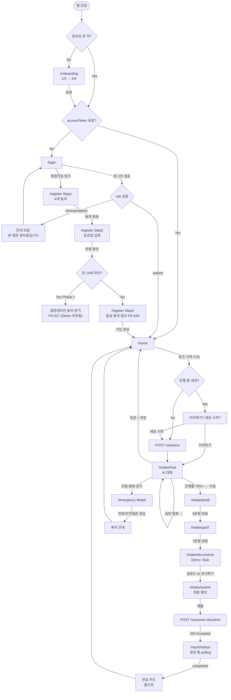
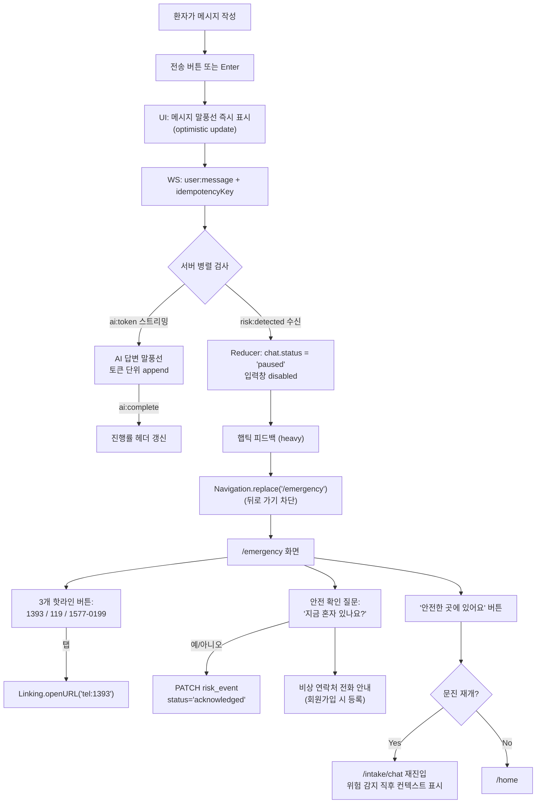
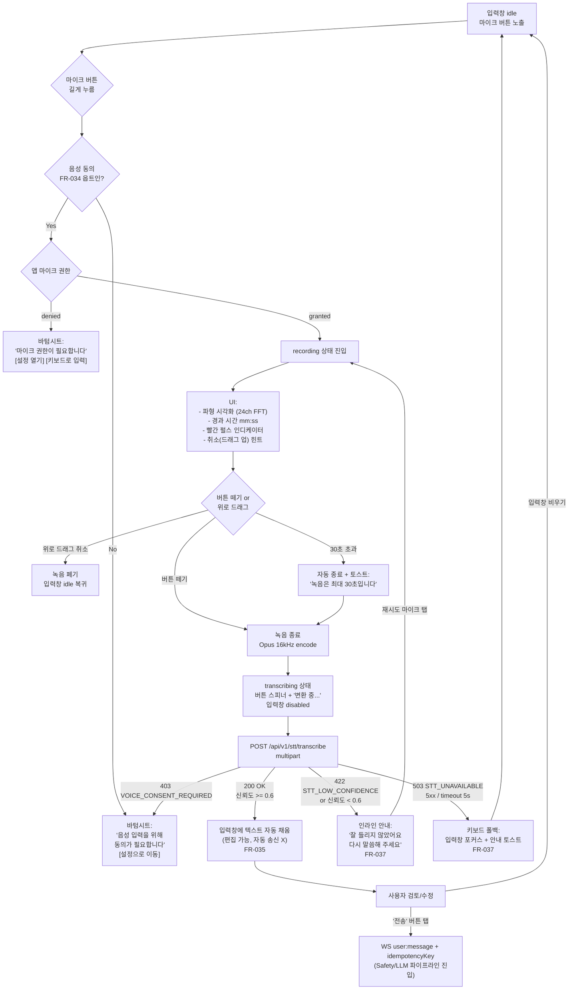
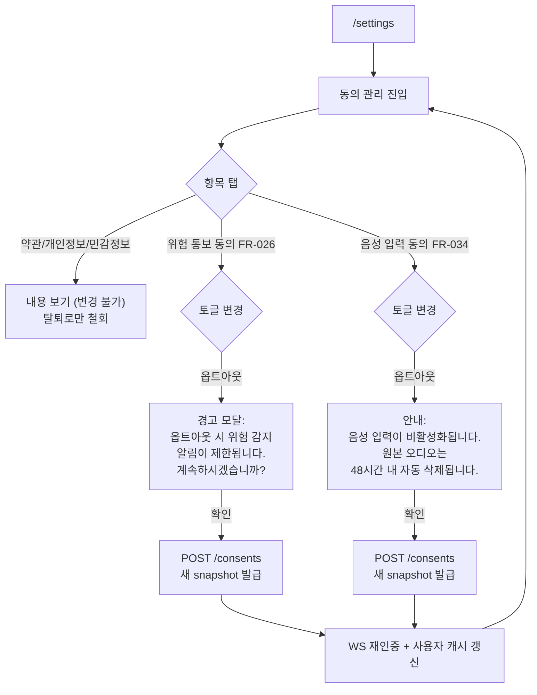
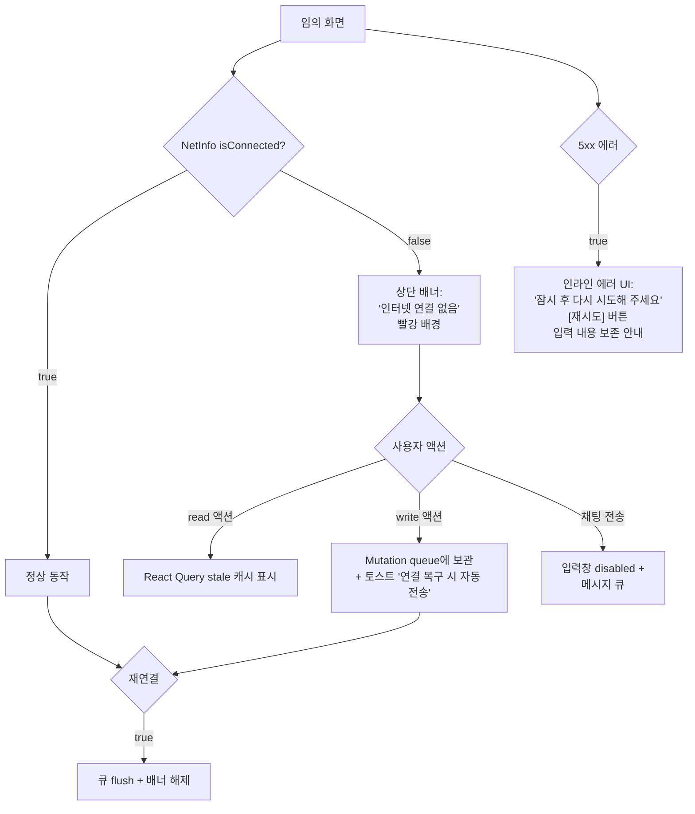
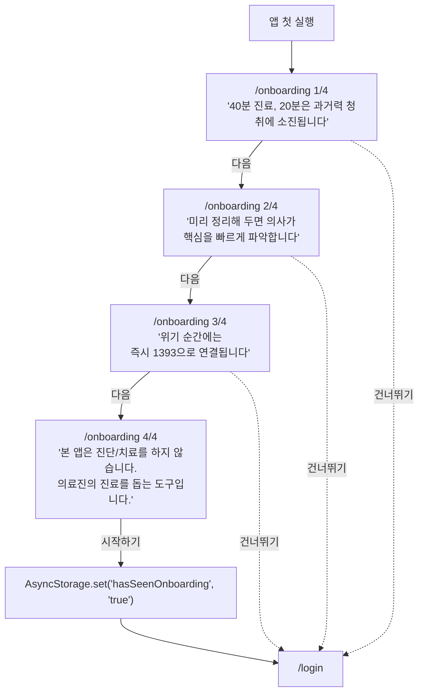

# Neuro-Sync User Flow — Mobile

> **Platform**: Mobile (React Native)
> **Source**: PRD §5.5 (Flow A/B/C/D). 본 문서는 모바일 환자 관점에서 분기 조건을 확장.
> **Generated**: 2026-06-06

본 문서는 PRD §5.5의 Flow A (환자 사전 문진), Flow C (안전 파이프라인), Flow D (STT 입력)를 모바일 환자 관점에서 확장한다. Flow B (의료진)는 웹 전용이므로 본 문서에서 제외.

---

## Flow A: 환자 사전 문진 (Mobile 확장)

### A.1 전체 시퀀스



### A.2 분기 조건 상세

| 분기 | 조건 | 결과 |
|------|------|------|
| 온보딩 표시 | `AsyncStorage.hasSeenOnboarding !== 'true'` | `/onboarding` 첫 진입 |
| 자동 로그인 | `accessToken` 존재 + JWT exp > 현재 | `/home` 직진. 만료 시 `refreshToken`으로 갱신 시도 |
| Role 차단 | `user.role !== 'patient'` | 모달 안내 + 로그아웃 |
| 법정대리인 동의 (Phase 2) | `currentYear - birthYear < 14` | `/register` Step2에서 보호자 본인인증 단계 추가 (Demo 미포함) |
| 문진 이어하기 | `sessions.status === 'in_progress'` 1건 이상 | 모달 `이어하기 / 새로 시작 / 취소` |
| Chat → PHQ-9 이동 | `progress >= 0.7` AND AI가 `next:phq9` 시그널 송신 | 자동 페이지 전환 (사용자 확인 후) |
| Documents 건너뛰기 | Demo 시 기본 활성 / Phase 2는 선택적 | Submit으로 직행 |
| 위험 감지 | WebSocket `risk:detected` (level ∈ {medium, high, critical}) | `/emergency` Modal 즉시 push (Chat 상태는 background 저장) |

### A.3 모바일 특수 분기

| 상황 | 처리 |
|------|------|
| 앱 백그라운드 → 포그라운드 (3분 이상 idle) | accessToken 유효성 재확인. 만료 시 silent refresh, 실패 시 `/login` |
| 네트워크 끊김 (NetInfo offline) | 상단 빨간 배너 + 입력 disabled. 재연결 시 자동 재시도 |
| 푸시 알림 탭 (Phase 2) | 딥링크로 해당 화면 직진. 미로그인 상태면 `/login` 후 큐잉 |
| 마이크 권한 거부 (FR-037) | `/intake/chat`에서 마이크 버튼 비활성화 + "설정에서 권한 허용" 토스트 + 키보드 폴백 |
| 위험 감지 중 백그라운드 진입 | 로컬 알림 "지금 도움이 필요하시면 1393으로 전화하세요" — Phase 2 |

---

## Flow C: 안전 파이프라인 (Safety) — Mobile 관점

PRD §5.5 Flow C를 모바일 클라이언트의 상태 전이 관점에서 재서술.



### C.1 클라이언트 상태 전이

```
chat.status: 'idle' → 'sending' → 'streaming' → 'idle'
                              ↘  'paused' → '/emergency' modal push → resume
```

| 이벤트 | UI 효과 | 사이드이펙트 |
|--------|--------|-------------|
| `risk:detected` (level=medium) | 노란 배너 "안전 확인이 필요해요" + 대화 계속 | risk_event log (status=detected) |
| `risk:detected` (level=high) | 즉시 `/emergency` modal push | risk_event log + (Phase 2) 비상 연락처 SMS |
| `risk:detected` (level=critical) | 즉시 `/emergency` + 1393 자동 다이얼 prompt | risk_event log + (Phase 2) 의료진 대시보드 알림 |

### C.2 백 버튼 / 제스처 차단

iOS 스와이프 백 제스처 + Android 하드웨어 백 버튼은 `/emergency` 노출 중 차단한다.
- iOS: `navigation.setOptions({ gestureEnabled: false })`
- Android: `useFocusEffect` + `BackHandler.addEventListener('hardwareBackPress', () => true)`

명시적 종료 경로는 "안전한 곳에 있어요" 버튼 1개로만 제공.

---

## Flow D: STT 입력 (Push-to-Talk) — Mobile 상세

PRD §5.5 Flow D를 모바일 RN 구현 관점에서 확장.



### D.1 상태 머신 (Recording State)

```
'idle' ─[long press]→ 'requesting-permission' ─[granted]→ 'recording'
                                              └[denied]→ 'idle' + sheet

'recording' ─[release]→ 'encoding' ─[done]→ 'transcribing'
            ├[drag-up cancel]→ 'idle'
            └[30s auto-stop]→ 'encoding'

'transcribing' ─[200 OK conf>=0.6]→ 'filled' (input editable)
              ├[low confidence]→ 'retry-prompt'
              ├[5xx/timeout]→ 'fallback-text' (키보드)
              └[403 consent]→ 'consent-required'

'filled' ─[send tap]→ 'idle' (메시지 큐 진입)
        └[clear]→ 'idle'
```

### D.2 모바일 UX 디테일

| 요소 | 사양 |
|------|------|
| 마이크 버튼 hit area | 최소 48×48 dp (a11y), 시각 크기 56dp 권장 |
| Long press threshold | 200ms (즉각 반응) |
| 햅틱 피드백 | 녹음 시작: light, 종료: medium, 위험 감지: heavy |
| 녹음 중 화면 dim | 배경 0.5 opacity 어둡게 — 집중 유도 |
| 파형 업데이트 | 60fps, 24 채널 FFT bin |
| 취소 제스처 | 마이크 버튼 위로 80px 드래그 시 빨간 X 표시 → 떼면 폐기 |
| 백그라운드 진입 시 | 즉시 녹음 종료 + 폐기 (오디오 누설 방지) |
| 호출 중 다른 음성 입력 (전화 등) | iOS `AVAudioSession` interruption → 녹음 종료 + idle 복귀 |

### D.3 48시간 폐기 잡 (FR-036)

클라이언트는 알 필요 없음. 다만 `/settings`에서 "변환 즉시 삭제" 옵션을 토글하면 백엔드에 `audio_recordings.delete_immediately = true`로 변경된 동의 스냅샷 신규 발급.

---

## Flow E: 동의 변경 (Settings) — Mobile 신규

PRD에는 명시되지 않았으나, FR-026/FR-034 동의가 옵트인 가능하므로 모바일 설정 화면의 동의 변경 플로우를 명시한다.



---

## Flow F: 오프라인 / 에러 폴백 (모바일 공통)



### F.1 오프라인 정책 (페이지별)

| 페이지 | 오프라인 동작 |
|--------|-------------|
| `/onboarding`, `/login`, `/register` | 입력은 가능, 제출 시 큐잉 (단 로그인은 즉시 에러 안내) |
| `/home` | 마지막 캐시 표시 + 오프라인 배지 |
| `/intake/chat` | 입력은 가능 (로컬 보존), 송신 큐잉. WebSocket 끊김 시 자동 재연결 |
| `/intake/phq9`, `/intake/gad7` | 응답 로컬 저장 → 재연결 시 일괄 송신 |
| `/intake/documents` | 업로드 큐잉 (Phase 2) |
| `/intake/submit` | 명시적 차단 — "제출은 인터넷 연결 후 가능합니다" |
| `/emergency` | **항상 동작** — 핫라인 전화 걸기는 셀룰러로 진행 |
| `/hospitals` | 캐시된 결과만 표시 (Phase 2) |
| `/report/status` | 마지막 polling 결과 표시 |
| `/settings` | 읽기 전용, 변경은 큐잉 |

---

## Flow G: 첫 사용자 진입 (Onboarding First-Run)



**원칙**:
- 4스텝 이하 (인지부하 최소화)
- 마지막 스텝은 **Non-Goals 명시** (PRD §1.3 정렬) — 의료 도구로서의 신뢰 형성
- "건너뛰기"는 항상 노출 (강요 금지)

---

## Critical Edge Cases (Mobile)

| 케이스 | 처리 |
|--------|------|
| 채팅 중 앱 강제 종료 후 재실행 | `sessions.status='in_progress'` 발견 → 홈에서 "이어하기" 카드 노출 |
| 동시 다중 세션 진입 | 백엔드가 1개 active session만 허용. 신규 요청 시 기존 session 자동 종료 + 안내 |
| Push-to-Talk 중 위험 발화 | STT 변환 후 입력창에 채워지지만 **자동 송신은 안 함** (FR-035). 사용자가 명시적 송신 후 Safety Guard가 감지 |
| `/emergency` 진입 후 앱 종료 | 백엔드 risk_event status는 `detected`로 유지. 재실행 시 홈 진입 전 안전 확인 모달 1회 노출 (Phase 2) |
| 로그아웃 시 진행 중 세션 | "저장 후 로그아웃"만 허용. 진행률 ≥ 50% 시 확인 모달 |
| 회원 탈퇴 (Phase 2) | FR-029 정책 — 즉시 삭제 항목과 가명처리 항목 분리 안내 후 처리 |
